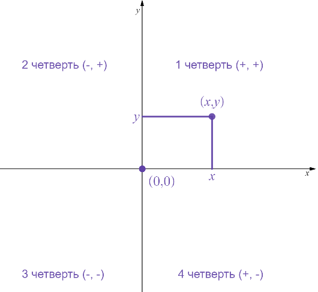
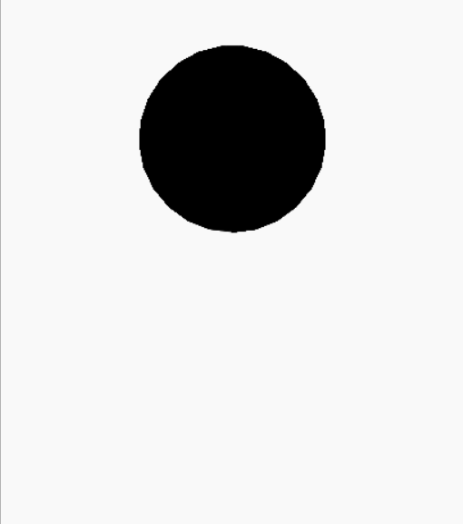

## Оглавление  
- [Ввод-вывод](#ввод-вывод)  
  - [Базовые команды](#базовые-команды)  
  - [sep, end](#sep-end)  
  - [Арифметика и её приоритеты](#арифметика-и-её-приоритеты)  
- [Логические операторы и их приоритеты](#логические-операторы-и-их-приоритеты)  
  - [If-elif-else](#if-elif-else)  
  - [Операторы сравнения](#операторы-сравнения)  
  - [or, and, not](#or-and-not)  
- [Типы данных](#типы-данных)  
  - [Числовые типы данных](#числовые-типы-данных)  
  - [Строковый тип данных](#строковый-тип-данных)  
  - [Модуль math](#модуль-math)  
- [Циклы](#циклы)  
  - [For](#for)  
  - [Частые сценарии](#частые-сценарии)  
  - [While](#while)  
  - [while: break, continue, else](#while-break-continue-else)  
  - [Вложенные циклы](#вложенные-циклы)  
- [Строки](#строки)  
  - [Индексация строк](#индексация-строк)  
  - [Вывод символов строки](#вывод-символов-строки)  
  - [Срезы строк](#срезы-строк)  
  - [Методы строк](#методы-строк)  
  - [partition()](#partition)  
  - [format(); format_map()](#format-format_map)  
  - [f-строки](#f-строки)  
  - [Строки в памяти компьютера](#строки-в-памяти-компьютера)  
  - [Сравнение строк](#сравнение-строк)  
- [Списки](#списки)  
  - [Создание списка](#создание-списка)  
  - [Основы (len, sum, min, max, in)](#основы-len-sum-min-max-in)  
  - [Добавление элементов](#добавление-элементов)  
  - [Объединение списков](#объединение-списков)  
  - [Удаление элементов](#удаление-элементов)  
  - [Вывод элементов списка](#вывод-элементов-списка)  
  - [split(), join()](#split-join)  
  - [Методы списков](#методы-списков)  
  - [Сортировка списков](#сортировка-списков)  
  - [Генераторы списков; списочные выражения](#генераторы-списков-списочные-выражения)  
  - [Нахождение чисел палиндромов](#нахождение-чисел-палиндромов)  
  - [Методы сортировки списков](#методы-сортировки-списков)  
- [Тип данных bool и NoneType](#тип-данных-bool-и-nonetype)  
  - [bool](#bool)  
  - [NoneType](#nonetype)  
- [Вложенные списки](#вложенные-списки)  
  - [Основы](#основы)  
  - [Матрицы, ljust(), rjust()](#матрицы-ljust-rjust)  
- [Кортежи](#кортежи)  
  - [Введение](#введение)  
  - [Основы](#основы-2)  
  - [Сравнение кортежей](#сравнение-кортежей)  
  - [Сортировка кортежей](#сортировка-кортежей)  
  - [Распаковка кортежей; “хвосты”](#распаковка-кортежей-хвосты)  
- [Множества](#множества)  
  - [Множества в математике](#множества-в-математике)  
  - [Пустое множество](#пустое-множество)  
  - [Числовые множества](#числовые-множества)  
  - [Операции над множествами](#операции-над-множествами)  
  - [Диаграммы Эйлера-Венна при решении задач](#диаграммы-эйлера-венна-при-решении-задач)  
  - [Введение в множества в Python](#введение-в-множества-в-python)  
  - [Создание множества](#создание-множества)  
  - [Вывод множества](#вывод-множества)  
  - [set()](#set)  
  - [Основы работы с множествами](#основы-работы-с-множествами)  
  - [Перебор элементов множества и распаковка](#перебор-элементов-множества-и-распаковка)  
  - [Сравнение множеств](#сравнение-множеств)  
  - [Методы множеств](#методы-множеств)  
  - [Генераторы множеств](#генераторы-множеств)  
  - [frozenset](#frozenset)  
- [Словари](#словари)  
  - [Введение](#введение-2)  
  - [Создание словаря](#создание-словаря)  
  - [Создание пустого словаря](#создание-пустого-словаря)  
  - [Важные детали](#важные-детали)  
  - [Основы (len, sum, min, max, in)](#основы-len-sum-min-max-in-2)  
  - [Сравнение словарей](#сравнение-словарей)  
  - [Перебор элементов словаря](#перебор-элементов-словаря)  
  - [Распаковка словарей](#распаковка-словарей)  
  - [Методы keys(), values(), items()](#методы-keys-values-items)  
  - [Сортировка словарей](#сортировка-словарей)  
  - [Методы словарей](#методы-словарей)  
  - [Генераторы словарей](#генераторы-словарей)  
  - [Вложенные словари](#вложенные-словари)  
- [Модули random, string, Метод Монте-Карло, Bogosort](#модули-random-string-метод-монте-карло-bogosort)  
  - [Модуль random](#модуль-random)  
  - [Модуль string](#модуль-string)  
  - [Метод Монте-Карло](#метод-монте-карло)  
  - [Bogosort](#bogosort)  
- [Модули decimal, fractions и complex](#модули-decimal-fractions-и-complex)  
  - [Модуль decimal: введение](#модуль-decimal-введение)  
  - [Создание Decimal чисел](#создание-decimal-чисел)  
  - [Арифметические операции над Decimal числами](#арифметические-операции-над-decimal-числами)  
  - [Математические функции Decimal чисел](#математические-функции-decimal-чисел)  
  - [Работа с контекстом Decimal чисел](#работа-с-контекстом-decimal-чисел)  
  - [Точность Decimal чисел](#точность-decimal-чисел)  
  - [Округление Decimal чисел](#округление-decimal-чисел)  
  - [Сравнение float и Decimal чисел](#сравнение-float-и-decimal-чисел)  
  - [Важные примечания для decimal](#важные-примечания-для-decimal)  
  - [Модуль fractions: введение](#модуль-fractions-введение)  
  - [Тип данных Fraction](#тип-данных-fraction)  
  - [Создание Fraction чисел](#создание-fraction-чисел)  
  - [Основы типа данных Fraction](#основы-типа-данных-fraction)  
  - [Сравнение Fraction чисел](#сравнение-fraction-чисел)  
  - [Арифметические операции над Fraction числами](#арифметические-операции-над-fraction-числами)  
  - [Математические функции](#математические-функции)  
  - [Свойства numerator и denominator, as_integer_ratio()](#свойства-numerator-и-denominator-as_integer_ratio)  
  - [Метод limit_denominator()](#метод-limit_denominator)  
  - [Комплексные числа: введение](#комплексные-числа-введение)  
  - [Комплексные числа в математике](#комплексные-числа-в-математике)  
  - [Комплексные числа в Python](#комплексные-числа-в-python)  
  - [Создание комплексных чисел](#создание-комплексных-чисел)  
  - [Арифметические операции над комплексными числами](#арифметические-операции-над-комплексными-числами)  
  - [Методы и свойства комплексных чисел](#методы-и-свойства-комплексных-чисел)  
  - [cmath](#cmath)  
- [Модуль turtle](#модуль-turtle)  
  - [Введение в turtle](#введение-в-turtle)  
  - [Рисование отрезков прямой](#рисование-отрезков-прямой)  
  - [Поворот черепашки](#поворот-черепашки)  
  - [Изменение внешнего вида черепашки](#изменение-внешнего-вида-черепашки)  
  - [Поднятие и опускание пера](#поднятие-и-опускание-пера)  
  - [Рисование кругов и точек](#рисование-кругов-и-точек)  
  - [Изменение размера пера](#изменение-размера-пера)  
  - [Изменение цвета рисунка](#изменение-цвета-рисунка)  
  - [Изменение цвета фона](#изменение-цвета-фона)  
  - [Создание штампа](#создание-штампа)  
  - [Возвращение экрана в исходное состояние](#возвращение-экрана-в-исходное-состояние)  
  - [Размер окна](#размер-окна)  
  - [Перемещение черепашки в заданную позицию](#перемещение-черепашки-в-заданную-позицию)  
  - [Получение текущей позиции черепашки](#получение-текущей-позиции-черепашки)  
  - [Сокрытие черепашки](#сокрытие-черепашки)  
  - [Управление скоростью анимации черепахи](#управление-скоростью-анимации-черепахи)  
  - [Вывод текста в графическое окно](#вывод-текста-в-графическое-окно)  
  - [Заполнение геометрических фигур](#заполнение-геометрических-фигур)  
  - [Создание нескольких черепашек](#создание-нескольких-черепашек)  
  - [Отслеживание нажатия клавиш](#отслеживание-нажатия-клавиш)  
  - [Отслеживание нажатия мыши](#отслеживание-нажатия-мыши)  
- [Функции](#функции)  
  - [Функции без параметров](#функции-без-параметров)  
  - [Функции с параметрами](#функции-с-параметрами)  
  - [Глобальные, нелокальные и локальные переменные](#глобальные-нелокальные-и-локальные-переменные)  
  - [Функции с возвратом значения](#функции-с-возвратом-значения)  
  - [Позиционные и именованные аргументы](#позиционные-и-именованные-аргументы)  
  - [Необязательные аргументы](#необязательные-аргументы)  
  - [Изменяемые типы в качестве значений по умолчанию](#изменяемые-типы-в-качестве-значений-по-умолчанию)  
  - [Переменное количество аргументов (*args, **kwargs)](#переменное-количество-аргументов-args-kwargs)  
  - [Передача аргументов в форме списка и кортежа](#передача-аргументов-в-форме-списка-и-кортежа)  
  - [Получение именованных аргументов в виде словаря](#получение-именованных-аргументов-в-виде-словаря)  
  - [Keyword-only и positional-only аргументы](#keyword-only-и-positional-only-аргументы)  
  - [Функции как объекты](#функции-как-объекты)  
  - [Функции в качестве аргументов других функций](#функции-в-качестве-аргументов-других-функций)  
  - [key в min(), max(), sort(), sorted()](#key-в-min-max-sort-sorted)  
  - [Функции в качестве возвращаемых значений других функций (вложенные функции)](#функции-в-качестве-возвращаемых-значений-других-функций-вложенные-функции)  
  - [Функции высшего порядка](#функции-высшего-порядка)  
  - [map()](#map)  
  - [filter()](#filter)  
  - [reduce()](#reduce)  
  - [Модуль operator](#модуль-operator)  
  - [Анонимные функции (lambda): введение](#анонимные-функции-lambda-введение)  
  - [Анонимные функции (lambda): основы, тернарный оператор](#анонимные-функции-lambda-основы-тернарный-оператор)  
  - [all(), any()](#all-any)  
  - [enumerate()](#enumerate)  
  - [zip()](#zip)  
  - [Рекурсия](#рекурсия)  
  - [Декораторы](#декораторы)  
- [Работа с файлами](#работа-с-файлами)  
  - [Введение](#введение-3)  
  - [languages.txt](#languagestxt)  
  - [Открытие файлов](#открытие-файлов)  
  - [Указание места расположения файла, сырые строки](#указание-места-расположения-файла-сырые-строки)  
  - [Кодировка](#кодировка)  
  - [Закрытие файлов](#закрытие-файлов)  
  - [read(), readline(), readlines()](#read-readline-readlines)  
  - [Бинарные файлы](#бинарные-файлы)  
  - [Свойства файла](#свойства-файла)  
  - [Позиция в файле (курсор)](#позиция-в-файле-курсор)  
  - [seek(), tell()](#seek-tell)  
  - [Менеджер контекста](#менеджер-контекста)  
  - [write(), writelines(), запись в файл при помощи print()](#write-writelines-запись-в-файл-при-помощи-print)  
- [Интересные штуки](#интересные-штуки)  
  - [Числовая угадайка](#числовая-угадайка)  
  - [Магический шар 8](#магический-шар-8)  
  - [Генератор безопасных паролей](#генератор-безопасных-паролей)  
  - [Калькулятор систем счисления (bin(), oct(), hex())](#калькулятор-систем-счисления-bin-oct-hex)  
  - [Угадайка слов](#угадайка-слов)  
- [Не вошедшее в конспект](#не-вошедшее-в-конспект)  
  - [Исключения (try-except-else-finally)](#исключения-try-except-else-finally)  
  - [Итераторы и генераторы](#итераторы-и-генераторы)  
- [Малоизвестные (или не мало) функции](#малоизвестные-или-не-мало-функции)  
  - [Спецификаторы](#спецификаторы)  
  - [Спецсимволы и экранирование](#спецсимволы-и-экранирование)  
  - [Неявная конкатенация](#неявная-конкатенация)  
  - [Моржовый оператор](#моржовый-оператор)  
  - [Присвоение цепочкой](#присвоение-цепочкой)  
  - [Константы](#константы)  
  - [Docstrings (Докстринги)](#docstrings-докстринги)  
  - [Многоточие (…) как объект](#многоточие-как-объект)  
  - [Атрибуты функций](#атрибуты-функций)  
  - [locals(), globals()](#locals-globals)  
  - [maketrans(), translate()](#maketrans-translate)  


Copyright (c) 2025 FerrumVega    
В конспекте использованы примеры и картинки из курсов https://stepik.org/course/58852 и https://stepik.org/course/68343.    
# Ввод-вывод  
## Базовые команды  
Для ввода используется команда `input()`    
Для вывода команда `print()`    

Для присвоения переменной значения используют знак `=`    
```python
a = 5  
print(a)  
>>> 5  
```  
## sep, end  
С помощью `sep `и `end `можно установить знак между аргументами и конец строки в `print() `    
Пример:    
```python
print("Hello", "World", sep="*", end="/")  
>>> Hello*World/  

```  
## Арифметика и её приоритеты  
```python
+  # сложение  
-  # вычитание  
/  # деление  
*  # умножение  
**  # возведение в степень  
%  # остаток от деления  
//  # целочисленное деление  
```  
Приоритеты (сверху самый высокий):    
```python
1.	()  
2.	**  
3.	- (унарный минус)  
4.	*, /, //, %  
5.	+, -  


```  
# Логические операторы и их приоритеты  
## If-elif-else  
```python
answer = input('Какой язык программирования мы изучаем?')  

if answer == 'Python':  
    print('Верно! Мы ботаем Python =)')  
    print('Python - отличный язык!')  
elif answer == "C++":  
    print('C++ тоже уважаем :)')  
else:  
    print('Не знаю такого :(')  
```  
## Операторы сравнения  
| Выражение   | Описание   |  
|---|---|  
| if x > 7   | если x больше 7   |  
| if x < 7   | если x меньше 7   |  
| if x >= 7   | если x больше либо равен 7   |  
| if x <= 7   | если x меньше либо равен 7   |  
| if x == 7   | если x равен 7   |  
| if x != 7   | если x не равен 7   |  

Также можно использовать цепочки: `a == b == c`    

## or, and, not  
```python
or  # логическое сложение  
and  # логическое умножение  
not  # логическое отрицание  
```  
Приоритеты (сверху самый высокий):    
```python
1.	not  
2.	and  
3.	or  

```  
# Типы данных  
## Числовые типы данных  
```python
int(n)  # целочисленный тип данных (1)  
float(n)  # число с плавающей точкой (0.1)  
max(a, b ... n)  # максимальное число  
min(a, b ... n)  # минимальное число  
abs(n)  # абсолютная величина числа (модуль)  

```  
Существует функция `divmod()`, которая возвращает кортеж из целочисленного частного x и y, и остатка от целочисленного частного из x и y:    
```python
print(divmod(5, 2))  
>>> (2, 1)  
```  
## Строковый тип данных  
```python
str("string")  # преобразование в строку  
len("string")  # длина строки  

print("ab"+"bc")  # конкатенация (сложение строк)  
>>> abbc  

print("Hi" * 4)  # умножение строки  
>>> HiHiHiHi  

text = """  
многострочный текст выделяется  
тройными кавычками  
"""  

print("ab" in "abc")  
>>> True  
print("ac" in "abc")  
>>> False  
print("AB" in "abc")  
>>> False  # in чувствителен к регистру  

```  
## Модуль math  
Существует 2 вида импорта модулей:    
```python
1. import math  
2. from math import *  
```  
При использовании первого нужно использовать команды так:    
```python
math.sqrt(25)  
```  
При использовании второго:    
```python
sqrt(25)  
```  
Второй метод проще, но при нём могут возникнуть конфликты из-за одинаковых команд в разных модулях    
Также можно импортировать всего несколько команд, а не все из модуля:    
```python
from math import sqrt  
sqrt(25)  


```  
Список функций модуля math    
| Функция   | Описание   |  
|---|---|  
| Округления   |    |  
| int()   | Округляет число в сторону нуля   |  
| round(x)   | Округляет число x до ближайшего целого. Если дробная часть числа равна 0.50.5, то число округляется до ближайшего четного числа (банковское округление)   |  
| round(x, n)   | Округляет число x до n знаков после точки   |  
| floor(x)   | Округляет число x вниз («пол»)   |  
| ceil(x)   | Округляет число x вверх («потолок»)   |  
| abs(x)   | Модуль числа x (абсолютная величина)   |  
| Корни, логарифмы, степени и факториал   |    |  
| sqrt(x)   | Квадратный корень числа x   |  
| pow(x, n)   | Возведение числа x в степень n   |  
| log(x)   | Натуральный логарифм числа x. Основание натурального логарифма равно числу e   |  
| log10(x)   | Десятичный логарифм числа x. Основание десятичного логарифма равно числу 10   |  
| log(x, b)   | Логарифм числа x по основанию b   |  
| factorial(n)   | Факториал натурального числа n   |  
| Тригонометрия   |    |  
| degrees(x)   | Преобразует угол x, заданный в радианах, в градусы   |  
| radians(x)   | Преобразует угол x, заданный в градусах, в радианы   |  
| cos(x)   | Косинус угла x, задаваемого в радианах   |  
| sin(x)   | Синус угла x, задаваемого в радианах   |  
| tan(x)   | Тангенс угла x, задаваемого в радианах   |  
| acos(x)   | Возвращает угол в радианах от 0 до π, cos которого равен x   |  
| asin(x)   | Возвращает угол в радианах от −π2−2π​ до π22π​, sin которого равен x   |  
| atan(x)   | Возвращает угол в радианах от −π2−2π​ до π22π​, tan которого равен x   |  
| atan2(y, x)   | Полярный угол (в радианах) точки с координатами (x, y)   |  

Python имеет и встроенную команду `round().`    
# Циклы  
## For  
for перебирает все значения из итератора и заполняет переменную текущим значением.    
С одним аргументом (от нуля до n-1):    
```python
for i in range(10):  
    print(i)  
>>> 0  
>>> 1  
>>> 2  
>>> 3  
>>> 4  
>>> 5  
>>> 6  
>>> 7  
>>> 8  
>>> 9  
```  
С двумя аргументами (от m до n-1):    
```python
for i in range(1, 10):  
    print(i)  
>>> 1  
>>> 2  
>>> 3  
>>> 4  
>>> 5  
>>> 6  
>>> 7  
>>> 8  
>>> 9  
```  
С тремя аргументами (от m до n-1 с шагом k):    
```python
for i in range(1, 10, 2):  # третий аргумент - величина шага  
    print(i)  
>>> 1  
>>> 3  
>>> 5  
>>> 7  
>>> 9  

```  
## Частые сценарии  
- Подсчёт количества  
```python
counter = 0  
for _ in range(10):  
    num = int(input())  
    if num > 10:  
        counter = counter + 1  

print('Было введено', counter, 'чисел, больших 10.')  

```  
- Обмен значений переменных  
Вместо:    
```python
temp = x  
x = y  
y = temp  
```  
Можно использовать:    
```python
x, y = y, x  

```  
- Сигнальные метки  
```python
num = int(input())  
flag = True  

for i in range(2, num):  
    if num % i == 0:  #  если исходное число делится на какое-либо отличное от 1 и самого себя  
        flag = False  

if num == 1:  
    print('Это единица, она не простая и не составная')   
elif flag == True:  
    print('Число простое')  
else:  
    print('Число составное')  

```  
- Максимум и минимум  
```python
largest = 0  
for _ in range(10):  
    num = int(input())      
    if num > largest:  
        largest = num  

print('Наибольшее число равно', largest)  

```  
- Расширенные операторы присваивания  
| Оператор   | Пример использования   | Эквивалент   |  
|---|---|---|  
| +=   | x += 5   | x = x + 5   |  
| -=   | x -= 2   | x = x - 2   |  
| *=   | x *= 10   | x = x * 10   |  
| /=   | x /= 4   | x = x / 4   |  
| //=   | x //= 4   | x = x // 4   |  
| %=   | x %= 4   | x = x % 4   |  

## While  
While выполняет команды внутри себя пока условие(-я) выполняется(-ются)    
- Обработка цифр числа:  
```python
n = int(input())  
while n != 0:  # пока в числе есть цифры  
    last_digit = n % 10  # получить последнюю цифру  
    # код обработки последней цифры  
    n = n // 10  # удалить последнюю цифру из числа  

```  
- «До остановки»:  
```python
text = input()  
total = 0  
while text != "stop":  
    total += int(text)  
    text = input()  
print("Сумма чисел равна", total)  

```  
## while: break, continue, else  
`break `завершает цикл    
Проверка числа на простоту:    
```python
num = int(input())  
flag = True  

for i in range(2, num):  
    if num % i == 0:  # если исходное число делится на какое-либо отличное от 1 и самого себя  
        flag = False  
        break  # останавливаем цикл если встретился делитель числа          
if flag:  # эквивалентно if flag == True:  
    print('Число простое')  
else:  
    print('Число составное')  

```  
`continue `позволяет перейти к следующей итерации цикла `for `или `while `до завершения всех команд в теле цикла.    
Программа, которая выводит все числа от 1 до 100, кроме чисел 7, 17, 29 и 78:    
```python
for i in range(1, 101):  
    if i == 7 or i == 17 or i == 29 or i == 78:  
        continue  # переходим на следующую итерацию  
    print(i)  

```  
Python допускает необязательный блок `else `в конце циклов `while` и `for`. Это уникальная особенность Python, не встречающаяся в большинстве других языков программирования. `else `выполнится, если цикл завершился без `break`. Синтаксис такой конструкции следующий:    
```python
while условие:  
    блок кода1  
else:  
    блок кода2  

# или  

for i in range(10):  
    блок кода1  
else:  
    блок кода2  
```  
Пример:    
```python
n = 5  
while n > 0:  
    n -= 1  
    print(n)  
else:  
    print("Цикл завершен.")  

```  
## Вложенные циклы  
```python
for hours in range(24):  
    for minutes in range(60):  
        for seconds in range(60):  
            print(hours, ':', minutes, ':', seconds)  
>>> 0 : 0 : 0  
>>> 0 : 0 : 1  
>>> 0 : 0 : 2  
...  
>>> 23 : 59 : 58  
>>> 23 : 59 : 59  
```  
При помощи вложенных циклов можно решать уравнения:    
Уравнение 12x+13y=777.    
Решение:    
```python
for x in range(777):  
    for y in range(777):  
        if 12 * x + 13 * y == 777:  
            print(x, y)  

```  
# Строки  
## Индексация строк  
  
Пример вывода символа из строки:    
```python
s = 'Python'  
print(s[1])  # выводит символ с индексом 1 (2 с начала)  
print(s[-3])  # выводит символ с индексом -3 (3 с конца)  
>>> y  
>>> h   

```  
## Вывод символов строки  
Для вывода каждого символа на новой строке используют такую конструкцию:    
```python
s = 'abcdef'  
for i in range(len(s)):  
    print(s[i])  
>>> a  
>>> b  
>>> c  
>>> d  
>>> e  
>>> f  

```  
## Срезы строк  
Срез выводит символы с x по y (правильнее будет сказать с x по y-1)    
  
```python
s = 'abcdefghij'  
print(s[2:5])  
>>> cde  
```  
Также можно опускать параметры в срезах    
  
  
```python
s = 'abcdefghij'  
print(s[2:])  
print(s[:7])  
>>> cdefghij  
>>> abcdefg  
```  
Также можно указать шаг среза, например, срез `s[1:7:2] `создаст строку bdf состоящую из каждого второго символа (индексы 1, 3, 5)    
  
Можно указать отрицательный шаг среза:    
| s = 'abcdefghij'   | s = 'abcdefghij'   | s = 'abcdefghij'   |  
|---|---|---|  
| Программный код   | Результат   | Пояснение   |  
| s[2:5]   | cde   | строка состоящая из символов с индексами 2, 3, 4   |  
| s[:5]   | abcde   | первые пять символов строки   |  
| s[5:]   | fghij   | строка состоящая из символов с индексами от 5 до конца   |  
| s[-2:]   | ij   | последние два символа строки   |  
| s[:]   | abcdefghij   | вся строка целиком   |  
| s[1:7:2]   | bdf   | строка, состоящая из каждого второго символа с индексами от 1 до 6   |  
| s[::-1]   | jihgfedcba   | строка в обратном порядке, так как шаг отрицательный   |  
```python
s = 'abcdefghij'  
print(s[::-1])  
>>> jihgfedcba  

```  
Изменение символа строки по индексу    
Предположим, у нас есть строка `s = 'abcdefghij' `и мы хотим заменить символ с индексом 4 на 'X'. Можно попытаться написать код:    
```python
s[4] = 'X'  
```  
Однако такой код не работает. В Python строки являются неизменяемыми, то есть мы не можем менять их содержимое с помощью индексатора.    
Правильный код:    
```python
s = s[:4] + 'X' + s[5:]  

```  
Можно присваивать переменным срезы:    
```python
a = slice(1, -1, 3)  
print("ABCDEFGHI"[a])  
>>> BEH  

```  
## Методы строк  
Методы к строкам применяются так: строка.метод    
- Конвертация регистра  
```python
s = 'foO BaR BAZ quX'  


print(s.capitalize())  # Первое слово с большой буквы, остальные - с маленькой  
>>> Foo bar baz qux  

print(s.swapcase())    # Меняет регистр всех символов на противоположный  
>>> FOo bAr baz QUx  

print(s.title())       # Каждое слово начинается с заглавной буквы  
>>> Foo Bar Baz Qux  

print(s.lower())       # Все символы приводятся к нижнему регистру  
>>> foo bar baz qux  

print(s.upper())       # Все символы приводятся к верхнему регистру  
>>> FOO BAR BAZ QUX  


a = "ßßß"  
b = "SSSSSS"  
print(a.casefold() == b.casefold())  # Переводит все символы в нижний регистр (Полезно при работе с немецким языком)  
>>> True  

```  
- Поиск и замена  
```python
s = 'foo bar foo baz foo qux'  

# Метод count(<sub>, <start>, <end>) - количество вхождений подстроки  
print(s.count('foo'))        
print(s.count('foo', 0, 10))   
>>> 3  
>>> 1  

# Метод startswith(<prefix>, <start>, <end>) - проверка начала строки  
print(s.startswith('foo'))    
print(s.startswith('bar'))   
>>> True  
>>> False  

# Метод endswith(<suffix>, <start>, <end>) - проверка конца строки  
print(s.endswith('qux'))      
print(s.endswith('bar'))     
>>> True  
>>> False  

# Метод find(<sub>, <start>, <end>) - индекс первого вхождения (или -1)  
print(s.find('foo'))          
print(s.find('python'))       
>>> 0  
>>> -1  

# Метод rfind(<sub>, <start>, <end>) - поиск с конца строки  
print(s.rfind('foo'))         
print(s.rfind('python'))      
>>> 16  
>>> -1  

# Метод index(<sub>, <start>, <end>) - как find(), но вызывает ошибку при отсутствии  
print(s.index('foo'))         
# print(s.index('python'))  # Вызовет ValueError  
>>> 0  

# Метод rindex(<sub>, <start>, <end>) - поиск с конца с ошибкой при отсутствии  
print(s.rindex('foo'))   
# print(s.rindex('python')) # Вызовет ValueError  
>>> 16  

s = '     foo bar foo baz foo qux      '  

# Метод strip() - удаляет пробелы с обоих концов  
print(s.strip())              
>>> foo bar foo baz foo qux  

# Метод lstrip() - удаляет пробелы только слева  
print(s.lstrip())            
>>> foo bar foo baz foo qux______  

# Метод rstrip() - удаляет пробелы только справа  
print(s.rstrip())             
>>> ______foo bar foo baz foo qux  

s = '-+-+abc+-+-'  

# Удаление указанных символов с обоих концов  
print(s.strip('+-'))          
>>> abc  

# Удаление указанных символов справа  
print(s.rstrip('+-'))         
>>> -+-+abc  

# Удаление указанных символов слева  
print(s.lstrip('+-'))         
>>> abc+-+-  

# Удаление указанного префикса (суффикса)  
print("-+-+abc+-+-".removeprefix("-+"))  
>>> -+abc+-+-  
print("-+-+abc+-+-".removesuffix("+-"))  
>>> -+-+abc+-  

s = 'foo bar foo baz foo qux'  

# Метод replace(<old>, <new>, <count>) - замена всех вхождений  
print(s.replace('foo', 'grault'))          # Все вхождения  
>>> grault bar grault baz grault qux  

print(s.replace('foo', 'grault', 2))       # Только 2 первых замены  
>>> grault bar grault baz foo qux0  

# Разделение на строки  
text_with_lot_of_lines = """A  
B  
C  
D  
E"""  
print(text_with_lot_of_lines.splitlines())  
>>> ['A', 'B', 'C', 'D', 'E']  

# Дополнение строку нулями слева, чтобы её общая длина стала равна аргументу  
print("234".zfill(12))  
>>> 000000000234  

```  
- Классификация символов  
```python
print('Python3'.isalnum())  # состоит ли строка только из букв и/или цифр  
>>> True  

print('Hello'.isalpha())  # состоит ли строка только из букв  
>>> True  

print('2023'.isdigit())  # состоит ли строка только из цифр  
>>> True  

print('python'.islower())  # все ли буквы в строке строчные  
>>> True  

print('PYTHON'.isupper())  # все ли буквы в строке заглавные  
>>> True  

print('   '.isspace())  # состоит ли строка только из пробелов  
>>> True  

```  
## partition()  
Помимо метода `split() `строковый тип данных содержит метод `partition()`. Метод `partition()` принимает на вход один аргумент `sep`, разделяет строку при первом появлении `sep` и возвращает кортеж, состоящий из трех элементов: часть перед разделителем, сам разделитель и часть после разделителя. Если разделитель не найден, то кортеж содержит саму строку, за которой следуют две пустые строки.    
```python
s1 = 'abc-de'.partition('-')  
s2 = 'abc-de'.partition('.')  
s3 = 'abc-de-fgh'.partition('-')  

print(s1)  
print(s2)  
print(s3)  
>>> ('abc', '-', 'de')  
>>> ('abc-de', '', '')  
>>> ('abc', '-', 'de-fgh')  

```  
## format(); format_map()  
В Python можно использовать заполнители:    
```python
birth_year = 1992  
name = 'Timur'  
profession = 'math teacher'  
text = 'My name is {}, I was born in {}, I work as a {}.'.format(name, birth_year, profession)  

print(text)  
>>> My name is Timur, I was born in 1992, I work as a math teacher.  

```  
Также можно несколько раз использовать один и тот же аргумент:    
```python
name = 'Timur'  
city = 'Moscow'  
text1 = 'My name is {0}-{0}-{0}!'.format(name, city)  
text2 = '{1} is my city and {0} is my name!'.format(name, city)  

print(text1)  
>>> My name is Timur-Timur-Timur!  

print(text2)  
>>> Moscow is my city and Timur is my name!  

```  
Также существует и функция `format():`    
Она применяет к первому аргументу форматирование (второй аргумент):    
```python
print(format(1.23456, ".2f"))  #  2 цифры после запятой  
>>> 1.23  

```  
Есть и метод `format_map()`:    
```python
print("Привет, {name}".format_map({"name": "Никита"}))  
>>> Привет, Никита  

```  
## f-строки  
Строки вида    
```python
name = 'Никита'  
print(name, "- мой друг")  
>>> Никита - мой друг  
```  
Можно изменить на:    
```python
name = 'Никита'  
print(f"{name} - мой друг")  
>>> Никита - мой друг  
```  
В f-строках переменные нужно указывать в {} скобках, а текст просто писать    

## Строки в памяти компьютера  
Таблица ASCII:    
  
Функция `ord() `позволяет определить код некоторого символа в таблице символов Unicode.    
```python
num1 = ord('A')  
num2 = ord('B')  
num3 = ord('a')   
print(num1, num2, num3)  
>>> 65 66 97  
```  
Функция `chr() `позволяет определить по коду символа сам символ. Аргументом данной функции является численный код.    
```python
chr1 = chr(65)  
chr2 = chr(75)  
chr3 = chr(110)  
print(chr1, chr2, chr3)  
>>> A K n  

```  
## Сравнение строк  
Строки можно сравнивать, работает это по лексикографическому порядку (точнее, по ASCII)    
Строчные символы больше заглавных    
```python
print('d' > 'D')  
print('Ы' < 'ы')  
>>> True  
>>> True  

```  
# Списки  
## Создание списка  
Списки могут содержать разные типы данных    
Список можно задать двумя способами:    
```python
a = []  
a = list()  

```  
## Основы (len, sum, min, max, in)  
```python
a = [1, 5, 3]  

print(len(a))  # длина списка (количество элементов)  
>>> 3  

print(sum(a))  # сумма элементов списка  
>>> 9  

print(min(a))  # минимум из списка  
>>> 1  

print(max(a))  # максимум из списка  
>>> 5  

print(1 in a)  # есть ли элемент со значением 1 в списке a  
>>> True  

```  
В списках индексация, срезы, конкатенация и умножение аналогично строкам, только тут вместо символов строки элементы списка.    

Отличие списков от строк:    
Несмотря на всю схожесть списков и строк, есть одно очень важное отличие: строки — неизменяемые объекты, а списки – изменяемые.    

Список можно удобно заполнить порядковыми числами:    
```python
a = list(range(1, 10, 2))  
print(a)  
>>> [1, 3, 5, 7, 9]  

```  
## Добавление элементов  
`a.append()` - добавление элемента в конец списка    
```python
a = [1, 1, 2, 3, 5, 8, 13]  
a.append(21)  # добавляем число 21 в конец списка  
a.append(34)  # добавляем число 34 в конец списка  
print(a)  
>>> [1, 1, 2, 3, 5, 8, 13, 21, 34]  

```  
## Объединение списков  
Чтобы объединить списки нужно использовать следующий метод:    
```python
a = [1, 2]  
b = [5, 7]  
a.extend(b)  
print(a)  
>>> [1, 2, 5, 7]  

```  
## Удаление элементов  
Для удаления элементов используется инструкция `del`    
Эту инструкцию можно использовать и для удаления переменных    
```python
a = [1, 2, 3, 4, 5, 6, 7, 8, 9]  
del a[5]    # удаляем элемент, имеющий индекс 5  
print(a)  
>>> [1, 2, 3, 4, 5, 7, 8, 9]  

```  
## Вывод элементов списка  
- Вывод через цикл  
```python
a = [0, 1, 2, 3, 4, 5, 6, 7, 8, 9, 10]  
for i in range(len(a)):  
    print(a[i])  
>>> 0  
>>> 1  
>>> 2  
>>> 3  
>>> 4  
>>> 5  
>>> 6  
>>> 7  
>>> 8  
>>> 9  
>>> 10  

```  
- Распаковка списка  
```python
a = [0, 1, 2, 3, 4, 5, 6, 7, 8, 9, 10]  
print(*a)  
>>> 0 1 2 3 4 5 6 7 8 9 10  

```  
- Распаковка списка и вывод каждого элемента на новой строке  
```python
a = [0, 1, 2, 3, 4, 5, 6, 7, 8, 9, 10]  
print(*a, sep="\n")  
>>> 0  
>>> 1  
>>> 2  
>>> 3  
>>> 4  
>>> 5  
>>> 6  
>>> 7  
>>> 8  
>>> 9  
>>> 10  

```  
## split(), join()  
Метод `split()` разбивает строку на слова, используя в качестве разделителя последовательность пробельных символов, и возвращает список из этих слов.    
```python
s = 'Python is the most powerful language'  
words = s.split()  
print(words)  
>>> ['Python', 'is', 'the', 'most', 'powerful', 'language']  
```  
Также можно указать аргумент, который будет разделителем:    
```python
ip = '192.168.1.24'  
numbers = ip.split('.')    # указываем явно разделитель  
print(numbers)  
>>> ['192', '168', '1', '24']  

```  
Метод `join()` собирает строку из элементов списка, используя в качестве разделителя строку, к которой применяется метод.    
```python
words = ['Python', 'is', 'the', 'most', 'powerful', 'language']  
s = ' '.join(words)  
print(s)  
>>> Python is the most powerful language  

```  
Шпаргалки:    
  
  
  

## Методы списков  
```python
s = [1, 3, 5]  
s.insert(4, 2)  # вставляет 2 в индекс 4  
print(s)  
>>> [1, 3, 5, 2]  

s = [1, 3, 5]  
print(s.index(3))  # выводит индекс первого вхождения 3 список s  
>>> 1  

s = [1, 3, 5]  
s.remove(3)  # удаляет первое вхождение элемента 3  
print(s)  
>>> [1, 5]  

s = [1, 3, 5]  
s.pop(2)  # удаляет элемент с индексом 2  
print(s)  
>>> [1, 3]  

s = [1, 3, 3, 3, 3, 5]  
print(s.count(3))  # выводит количество элементов со значением 3  
>>> 4  

s = [1, 3, 5]  
s.reverse()  # переворачивает список  
print(s)  
>>> [5, 3, 1]  

s = [1, 3, 5]  
s.clear()  # очищает список  
print(s)  
>>> []  

s = [1, 3, 5]  
g = s.copy()  # делает копия списка, при изменении оригинала копия тоже изменяется  
print(g)  
>>> [1, 3, 5]  

```  
## Сортировка списков  
В Python списки имеют встроенный метод `sort()`, который сортирует элементы списка по возрастанию или убыванию.    
```python
a = [1, 7, -3, 9, 0, -67, 34, 12, 45, 1000, 6,  8, -2, 99]  
a.sort()  
print('Отсортированный список:', a)  
>>> Отсортированный список: [-67, -3, -2, 0, 1, 6, 7, 8, 9, 12, 34, 45, 99, 1000]  
```  
Также можно сортировать по убыванию. Если требуется отсортировать список по убыванию, необходимо явно указать параметр `reverse = True.`    
```python
a = [1, 7, -3, 9, 0, -67, 34, 12, 45, 1000, 6,  8, -2, 99]  
a.sort(reverse=True)  # сортируем по убыванию  
print('Отсортированный список:', a)  
>>> Отсортированный список: [1000, 99, 45, 34, 12, 9, 8, 7, 6, 1, 0, -2, -3, -67]  
```  
Функция `sorted() `возвращает отсортированный список, не изменяя оригинальный.    
```python
a = [1, 5, 3]  
print(sorted(a))  
>>> [1, 3, 5]  
```  
## Генераторы списков; списочные выражения  
```python
numbers = [i for i in range(10)]  # числа от 0 до 9  
print(numbers)  
>>> [0, 1, 2, 3, 4, 5, 6, 7, 8, 9]  

numbers = [i**2 for i in range(10)]  # квадраты чисел от 0 до 9  
print(numbers)  
>>> [0, 1, 4, 9, 16, 25, 36, 49, 64, 81]  

numbers = [int(input()) for i in range(int(input()))]  # ввод n чисел с клавиатуры  
print(numbers)  
<<< 5  
<<< 1  
<<< 2  
<<< 3  
<<< 4  
<<< 5  
>>> [1, 2, 3, 4, 5]  

numbers = [i * j for i in range(1, 5) for j in range(2)]  # вложенные циклы  
print(numbers)  
>>> [0, 1, 0, 2, 0, 3, 0, 4]  

numbers = [i for i in range(21) if i % 2 == 0]  # четные числа от 0 до 20 (условие в списочном выражении)  
print(numbers)  
>>> [0, 2, 4, 6, 8, 10, 12, 14, 16, 18, 20]  
```  
В списочных выражениях нельзя использовать `else` и несколько условий.    

## Нахождение чисел палиндромов  
Во-первых, вот что такое палиндром:    
Числа-палиндромы — числа, которые в определённой позиционной системе исчисления (как правило — в десятичной) читаются одинаково как справа налево, так и слева направо.    
Достаточно просто доказать, что чисел-палиндромов бесконечно много. Одним из способов доказательства является замена любой выбранной цифры в их написании двумя любыми другими цифрами, в результате чего получается новое число-палиндром.    
```python
palindromes = [i for i in range(100, 1001) if i == int(str(i)[::-1])]  
print(palindromes)  

```  
## Методы сортировки списков  
- Сортировка пузырьком  
Алгоритм сортировки пузырьком состоит из повторяющихся проходов по сортируемому списку. За каждый проход элементы последовательно сравниваются попарно и, если порядок в паре неверный, выполняется обмен элементов. Проходы по списку повторяются n−1 раз, где n – длина списка. При каждом проходе алгоритма по внутреннему циклу, очередной наибольший элемент списка ставится на свое место в конце списка рядом с предыдущим «наибольшим элементом».    
Наибольший элемент каждый раз «всплывает» до нужной позиции, как пузырёк в воде — отсюда и название алгоритма.    

Алгоритм пузырьковой сортировки считается учебным и практически не применяется вне учебной литературы, а на практике применяются более эффективные.    

Реализация:    
```python
a = [1, 7, -3, 9, 0, -67, 34, 12, 45, 1000, 6,  8, -2, 99]  
n = len(a)  

for i in range(n - 1):  
    for j in range(n - 1 - i):  
        if a[j] > a[j + 1]:                  # если порядок элементов пары неправильный  
            a[j], a[j + 1] = a[j + 1], a[j]  # меняем элементы пары местами   

print('Отсортированный список:', a)  

```  
- Сортировка выбором  
Сортировка выбором улучшает пузырьковую сортировку, совершая всего один обмен за каждый проход по списку. Для этого алгоритм ищет максимальный элемент и помещает его на соответствующую позицию. Как и для пузырьковой сортировки, после первого прохода самый большой элемент находится на правильном месте. После второго прохода на своё место становится следующий максимальный элемент. Проходы по списку повторяются n−1 раз, где n – длина списка, поскольку последний из них автоматически оказывается на своем месте.    

Алгоритм сортировки выбором также считается учебным и практически не применяется вне учебной литературы. На практике используют более эффективные алгоритмы.    

Реализация:    
```python
a = [78, -32, 5, 39, 58, -5, -63, 57, 72, 9, 53, -1, 63, -97, -21, -94, -47, 57, -8, 60, -23, -72, -22, -79, 90, 96, -41, -71, -48, 84, 89, -96, 41, -16, 94, -60, -64, -39, 60, -14, -62, -19, -3, 32, 98, 14, 43, 3, -56, 71, -71, -67, 80, 27, 92, 92, -64, 0, -77, 2, -26, 41, 3, -31, 48, 39, 20, -30, 35, 32, -58, 2, 63, 64, 66, 62, 82, -62, 9, -52, 35, -61, 87, 78, 93, -42, 87, -72, -10, -36, 61, -16, 59, 59, 22, -24, -67, 76, -94, 59]  

n = len(a)  

for i in range(n):  
    mx = max(a[:n - i])  
    mx_ind = a.index(mx)  

    a[n - 1 - i], a[mx_ind] = a[mx_ind], a[n - 1 - i]  

print('Отсортированный список:', a)  

```  
- Сортировка простыми вставками  
Алгоритм сортировки простыми вставками делит список на 2 части — отсортированную и неотсортированную. Из неотсортированной части извлекается очередной элемент и вставляется на нужную позицию в отсортированной части, в результате чего отсортированная часть списка увеличивается, а неотсортированная уменьшается. Так происходит, пока не исчерпан набор входных данных и не отсортированы все элементы.    

Сортировка простыми вставками наиболее эффективна, когда список уже частично отсортирован и элементов массива немного. Если элементов в списке меньше 10, то этот алгоритм - один из самых быстрых.    

Реализация:    
```python
a = [1, 7, -3, 9, 0, -67, 34, 12, 45, 1000, 6,  8, -2, 99]  
n = len(a)  

for i in range(1, n):   
    elem = a[i]  # берем первый элемент из неотсортированной части списка  
    j = i  

    # пока элемент слева существует и больше нашего текущего элемента  
    while j >= 1 and a[j - 1] > elem:  
        # смещаем j-1-й элемент отсортированной части вправо  
        a[j] = a[j - 1]  
        # сами идём влево, дальше ищем место для нашего текущего элемента  
        j -= 1  

    # нашли место для нащего текущего элемента из неотсортированной части  
    # и вставляем его на индекс j в отсортированной части  
    a[j] = elem  

print('Отсортированный список:', a)  


```  
# Тип данных bool и NoneType  
## bool  
- bool может иметь значение `True `или `False`.  
- `a and b `дает `True`, если оба операнда `True`, или `False`, если хотя бы один из них `False`  
- `a or b `дает `False`, если оба операнда `False`, или `True`, если хотя бы один из них `Truef`  
- `not a` дает `True`, если `a` имеет значение `False`, или `False`, если `a` имеет значение `True`.  

```python
print(True == 1)  
print(False == 0)  
>>> True  
>>> True  

print(True == 1)  
print(False == 0)  
>>> True  
>>> True  
```  
Для приведения других типов данных к булеву существует функция `bool()`, работающая по следующим соглашениям:    
- строки: пустая строка – ложь (`False`), непустая строка – истина (`True`)  
- числа: нулевое число – ложь (`False`), ненулевое число (в том числе и меньшее нуля) – истина (`True`)  
- списки: пустой список – ложь (`False`), непустой – истина (`True`).  

В языке Python имеется встроенная функция `isinstance()` для проверки соответствия типа объекта какому-либо типу данных.    
```python
print(isinstance(3, int))  
print(isinstance(3.5, float))  
print(isinstance('Beegeek', str))  
print(isinstance([1, 2, 3], list))  
print(isinstance(True, bool))  
>>> True  
>>> True  
>>> True  
>>> True  
>>> True  

```  
В языке Python имеется встроенная функция `type()`, позволяющая получить тип указанного в качестве аргумента объекта.    
```python
print(type(3))  
print(type(3.5))  
print(type('Beegeek'))  
print(type([1, 2, 3]))  
print(type(True))  
>>> <class 'int'>  
>>> <class 'float'>  
>>> <class 'str'>  
>>> <class 'list'>  
>>> <class 'bool'>  

```  
## NoneType  
```python
var = None  
print(type(var))  
>>> <class 'NoneType'>  
```  
Сравнение `None` с любым объектом, отличным от `None`, дает значение `False`. `None` возвращается если функция ничего не вернула. Рекомендуется сравнивать `None` через `is`:    
```python
a = None  
print(a is None)  
>>> True  

```  
# Вложенные списки  
## Основы  
Создание вложенного списка:    
```python
my_list = [[0], [1, 2], [3, 4, 5]]  
```  
Чтобы получить число 2 мы используем такую команду:    
```python
my_list = [[0], [1, 2], [3, 4, 5]]  
print(my_list[1][1])  # сначала получаем список с индексом 1 ([1, 2]), а затем первый индекс (2)  
>>> 2  

```  
Функции `min()` и `max() `могут работать и со списками. Если этим функциям передается несколько списков, то целиком возвращается один из переданных списков. При этом сравнение происходит поэлементно: сначала сравниваются первые элементы списков. Если они не равны, то функция `min()` вернет тот список, первый элемент которого меньше, `max()` – наоборот. Если первые элементы равны, то будут сравниваться вторые и т. д.    
Пример:    
Задача:    
На вход программе подается число n. Напишите программу, которая создает и выводит построчно вложенный список, состоящий из n списков [[1], [1, 2], [1, 2, 3], ..., [1, 2, ..., n]].    
Формат входных данных
На вход программе подается натуральное число n.    
Формат выходных данных
Программа должна вывести построчно указанный вложенный список.    
Решение:    
```python
print(*[[i for i in range(1, j+1)] for j in range(1, int(input())+1)], sep="\n")  

```  
## Матрицы, ljust(), rjust()  
Матрицы - прямоугольные таблицы, заполненные какими-то значениями, обычно числами.    
  

Перебор элементов матрицы:    
```python
rows, cols = 3, 4  # rows - количество строк, cols - количество столбцов  

matrix  = [[2, 3, 1, 0],  
           [9, 4, 6, 8],  
           [4, 7, 2, 7]]  

for r in range(rows):  
    for c in range(cols):  
        print(matrix[r][c], end=' ')  
    print()  
>>> 2 3 1 0   
>>> 9 4 6 8   
>>> 4 7 2 7  
```  
Строковый метод `ljust(arg) `выравнивает текст по ширине, добавляя пробелы в конец текста:    
Строковый метод `rjust(arg)` выравнивает текст по ширине, добавляя пробелы в начало текста:    
```python
matrix = [[1, 2, 3],   
          [4, 590, 6],   
          [70, 8, 9]]  

for i in range(3):  
    for j in range(3):  
        print(str(matrix[i][j]).ljust(5), end="")  
    print()  

print()  

for i in range(3):  
    for j in range(3):  
        print(str(matrix[i][j]).rjust(5), end="")  
    print()  
>>> 1    2    3      
>>> 4    590  6  
>>> 70   8    9  

>>>     1    2    3  
>>>     4  590    6  
>>>    70    8    9  

```  
Таблица умножения n на m:    
```python
n, m = int(input()), int(input())  
s = [[i * j for i in range(m)] for j in range(n)]  
for i in s:  
    print(*i)  
<<< 4  
<<< 6  
>>> 0 0 0 0 0 0  
>>> 0 1 2 3 4 5  
>>> 0 2 4 6 8 10  
>>> 0 3 6 9 12 15  

```  
# Кортежи  
## Введение  
Кортежи по своей природе (задумке) – неизменяемые аналоги списков. Кортеж описывается следующим образом:    
```python
list = []  # список  
tuple = ()  # кортеж  
```  
Для создания кортежа с единственным элементом после значения элемента ставят замыкающую запятую:    
```python
my_tuple = (1,)  
print(type(my_tuple))  
>>> <class 'tuple'>  
```  
Если её не поставить, то будет создан не кортеж, а просто переменная со значением 1 (типа `int`)    

В чём кортеж превосходит список?    
- Скорость  
- Безопасность  
Где встречаются кортежи? Если функция возвращает несколько значений, она возвращает кортеж.    

Важно! Тот факт, что кортеж является неизменяемым вовсе не означает, что мы не можем поменять содержимое списка в кортеже.    

## Основы  
Кортеж можно превратить в список используя функцию `list(mytuple)`.    
Список можно превратить в кортеж используя функцию `tuple(mylist)`.    
Кортеж можно преобразовать в строку с помощью строкового метода `join(mytuple)`.    
Строку можно преобразовать в кортеж с помощью функции `tuple(mystring)`.    

Кортежи поддерживают:    
- доступ к элементу по индексу (только для получения значений элементов)  
- методы, в частности `index()`, `count()`  
- встроенные функции, в частности `len(), sum(), min(), max()`  
- срезы  
- оператор принадлежности `in`  
- операторы конкатенации (+) и повторения (*).  
Кортежи могут иметь вложенные кортежи и вложенные списки.    

## Сравнение кортежей  
```python
print((1, 8) == (1, 8))  
print((1, 8) != (1, 10))  
print((1, 9) < (1, 2))  
print((2, 5) < (6,))  
print(('a', 'bc') > ('a', 'de'))  

>>> True  
>>> True  
>>> False  
>>> True  
>>> False  
```  
Обратите внимание: операции == и != применимы к любым кортежам, независимо от типов элементов. А вот операции <, >, <=, >= применимы только в том случае, когда соответствующие элементы кортежей имеют один тип.    

## Сортировка кортежей  
Так как кортежи неизменяемы, то и метода `sort()` у них нет. Но кортеж можно отсортировать при помощи функции  `sorted()`. Данная функция возвращает отсортированный кортеж/список, а не сортирует его «на месте».    
Примеры решения задач:    
Условие: Напишите программу, которая выводит список хорошистов и отличников в классе.    
Формат входных данных    
На вход программе подается натуральное число    
n, далее следует n строк с фамилией школьника и его оценкой на каждой из них.    
Формат выходных данных    
Программа должна вывести сначала все введённые строки с фамилиями и оценками учеников в том же порядке. Затем следует пустая строка, а затем выводятся строки с фамилиями и оценками хорошистов и отличников (в том же порядке).    
Решение:    
```python
a = [tuple(input().split()) for _ in range(int(input()))]  # создаем n кортежей, которые будут иметь 2 значения - фамилия и оценка  
for i in a:  
    print(*i)  

print()  

for name, grade in a:  # перебираем каждый кортеж  
    if int(grade) > 3:  # если оценка выше 3, выводим имя и оценку  
        print(name, grade)  

```  
## Распаковка кортежей; “хвосты”  
Кортежи можно распаковывать так:    
```python
print(*tuple)  
```  
Но мы также можем присвоить переменным значения элементов кортежа:    
```python
colors = ('red', 'green', 'blue', 'cyan')  

(a, b, c, d) = colors  

print(a)  
print(b)  
print(c)  
print(d)  
>>> red  
>>> green  
>>> blue  
>>> cyan  
```  
При этом переменных должно быть ровно столько, сколько символов в кортеже.    
Но что делать если нам нужны например только первые 2 переменные из кортежа/списка? Для этого используют такую конструкцию:    
```python
*names, surname = ('Стефани', 'Джоанн', 'Анджелина', 'Джерманотта')  

print(names)  
print(surname)  
>>> ['Стефани', 'Джоанн', 'Анджелина']  
>>> Джерманотта  
```  
Перед `names` мы поставили `*`, это означает что это список, который примет все значения, которые не приняли другие переменные.    
Учтите, что `*tail` всегда будет списком, даже когда в него попадает лишь один элемент или даже ноль.    

# Множества  
## Множества в математике  
В математике множество – совокупность объектов, понимаемых как единое целое. Обычно множества обозначают большими латинскими буквами.    
Если два множества X и Y состоят из одних и тех же элементов, то они называются равными X=Y. Обратите внимание, порядок расположения элементов в записи множеств при их сравнении во внимание не принимается.    
Если все элементы множества X принадлежат также и множеству Y, то говорят, что X является подмножеством Y, а записывается это так: X ⊂ Y.    
Если множество X конечно, то через ∣X∣ обозначается количество элементов множества X.    
Множество X, содержащее n элементов, имеет 2^n подмножеств, включая пустое. Например, X = {a, b, c} (3 элемента) имеет 8 подмножеств: ∅, {a}, {b}, {c}, {a, b}, {a, c}, {b, c}, {a, b, c}.    
Важно! Множества – неупорядоченные совокупности, то есть неважно, в каком порядке указаны элементы множества.    

## Пустое множество  
Пустое множество – множество, не содержащего ни одного элемента. Оно обозначается знаком ∅.    

## Числовые множества  
- Натуральные числа:  
N={1,2,3,4,5,…}    
- Целые числа:  
Z={0,±1,±2,±3,±4,±5,…}    
- Рациональные числа. Рациональным числом в математике называется любое число, представимое в виде частного двух целых чисел с отличным от нуля знаменателем. Множество рациональных чисел обозначается буквой Q и содержит следующие числа:  
Q={, m∈Z, n∈N}.    
- Иррациональные числа. Не все числа в математике можно представить в виде рационального числа. Примером служат числа:  
≈1.414213562…    
π≈3.1415926535…    
e≈2.71828182845…    
Такие числа называются иррациональными и являются бесконечными непериодическими дробями. Иными словами, в «бесконечных хвостах» иррациональных чисел нет никакой закономерности. Иррациональные числа часто обозначают буквой I.    
- Вещественные числа:  
Объединение рациональных и иррациональных чисел образует множество вещественных чисел. Множество вещественных чисел R определяется так: R=Q∪I. Символ ∪ – означает объединение множеств.    
- Комплексные числа:  
Комплексные числа — это числа вида a + bi, где a и b — действительные числа, а i — мнимая единица (i^2 = −1).    
Это множество обозначают буквой C.    

## Операции над множествами  
- Объединение множеств – множество, состоящее из элементов, принадлежащих хотя бы одному из объединяемых множеств. Для объединения множеств используется символ ∪.  
  

- Пересечение множеств – множество, состоящее из элементов, принадлежащих одновременно каждому из пересекающихся множеств. Для пересечения множеств используется символ ∩.  
  

- Разность множеств – множество, в которое входят только элементы первого множества, не входящие во второе множество. Для разности множеств используется символ ∖.  
  

- Симметрическая разность множеств – множество, включающее все элементы исходных множеств, не принадлежащие одновременно обоим исходным множествам. Для симметрической разности множеств используется символ △.  
  

- Дополнение множества – множество всех элементов, в нем не содержащихся. Для операции дополнения множества используется символ ¬.  
  

## Диаграммы Эйлера-Венна при решении задач  
Задача. Каждый ученик онлайн-школы BEEGEEK изучает или математику или информатику, или и то и другое одновременно. Всего 75 учеников изучает математику, а 27 – информатику и только 13 – оба предмета. Сколько учеников учится в онлайн-школе BEEGEEK?    
Решение. Введем обозначения: множество учеников, изучающих математику – М, информатику – И. Изображаем множества на диаграмме Эйлера-Венна в наиболее общем случае.    
  
Рассуждаем следующим образом: оба предмета изучают 13 учеников. Значит, только математику изучают 75 − 13 = 62 ученика, только информатику изучают 27 − 13 = 14 учеников. Таким образом, всего в школе учится 62 + 13 + 14 = 89 учеников. Ответ: 89.    

## Введение в множества в Python  
Важно знать:    
- все элементы множества различны (уникальны), два элемента не могут иметь одинаковое значение  
- множества неупорядочены, то есть элементы не хранятся в каком-то определенном порядке  
- элементы множества должны относиться к неизменяемым типам данных  
- хранящиеся в множестве элементы могут иметь разные типы данных.  
- Множества изменяемы  
Множество не может содержать список, множество, однако может содержать кортеж.    

## Создание множества  
Чтобы создать множество, нужно перечислить его элементы через запятую в фигурных скобках:    
```python
numbers = {2, 4, 6, 8, 10}  
languages = {"Python", "C#", "C++", "Java"}  
favorites = {"Nikita", 144, "My friend"}  

```  
Создать пустое множество можно с помощью встроенной функции, которая называется `set()`:    
```python
myset = set()  # пустое множество  
```  
Важно! Создать пустое множество с помощью пустых фигурных скобок нельзя:    
```python
myset = {}  # создается словарь  

```  
## Вывод множества  
Вывести множество можно через `print(myset)`.    
Обратите внимание: при выводе множества порядок элементов может отличаться от существовавшего при его создании, поскольку множества — неупорядоченные коллекции данных.    

## set()  
Встроенная функция `set() `помимо создания пустого множества может преобразовывать некоторые типы объектов в множества. В функцию `set() `можно передать один аргумент. Передаваемый аргумент должен быть итерируемым объектом, таким как список, кортеж или строковое значение. Отдельные элементы объекта, передаваемого в качестве аргумента, становятся элементами множества:    
```python
myset1 = set(range(10))          # множество из элементов последовательности  
myset2 = set([1, 2, 3, 4, 5])    # множество из элементов списка  
myset3 = set('abcd')             # множество из элементов строки  
myset4 = set((10, 20, 30, 40))   # множество из элементов кортежа  
```  
Пустое множество также можно создать передав функции `set() `в качестве аргумента пустой список, строку или кортеж:    
```python
emptyset1 = set([])  # пустое множество из пустого списка  
emptyset2 = set('')  # пустое множество из пустой строки  
emptyset3 = set(())  # пустое множество из пустого кортежа  

```  
Множества не могут содержать повторяющиеся элементы. Если в функцию `set()` передать аргумент, содержащий повторяющиеся элементы, то в множестве появится только один из этих повторяющихся элементов.    
```python
myset1 = {2, 2, 4, 6, 6}  
myset2 = set([1, 2, 2, 3, 3])  
myset3 = set("aaaaabbbbccccddd")  

print(myset1)  
print(myset2)  
print(myset3)  
>>> {2, 4, 6}  
>>> {1, 2, 3}  
>>> {"b", "c", "d", "a"}  

```  
Если требуется создать множество, в котором каждый элемент — строковое значение, содержащее более одного символа, то используем код:    
```python
myset = set(['aaa', 'bbbb', 'cc'])  

print(myset)  
>>> {'bbbb', 'aaa', 'cc'}  
```  
Однако вот что будет, если аргумент будет строкой:    
```python
myset = set('aaa bbbb cc')  

print(myset)  
>>> {' ', 'c', 'a', 'b'}  

```  
## Основы работы с множествами  
- Функция `len() `возвращает длину множества (количество элементов).  
- Оператор `in `позволяет проверить, содержит ли множество некоторый элемент. В множествах он работает намного быстрее чем в списках.  
- Встроенная функция `sum()` принимает в качестве аргумента множество чисел и вычисляет сумму его элементов.  
- Встроенные функции `min() `и `max()` принимают в качестве аргумента множество и находят минимальный и максимальный элементы соответственно.  
Важно! Индексация и срезы недоступны для множеств. Операция конкатенации + и умножения на число * тоже недоступны для множеств.    

## Перебор элементов множества и распаковка  
Перебор элементов множества осуществляется точно так же, как и перебор элементов списка, то есть с помощью цикла `for`.    
Для вывода элементов множества каждого на отдельной строке можно использовать следующий код:    
```python
numbers = {0, 1, 1, 2, 3, 3, 3, 5, 6, 7, 7}  

for num in numbers:  
    print(num)  
>>> 0  
>>> 1  
>>> 2  
>>> 3  
>>> 5  
>>> 6  
>>> 7  
```  
Но также можно распаковать таким способом:    
```python
numbers = {0, 1, 1, 2, 3, 3, 3, 5, 6, 7, 7}  

print(*numbers)  
>>> 0 1 2 3 5 6 7  
```  
Помните, что множества - неупорядоченные коллекции, а значит если вам нужно вывести элементы по возрастанию, используйте функцию `sorted()`, которая вернёт отсортированный список. Метода `sort()` у множеств нет. В функции можно указать необязательный параметр `reverse`. При `reverse=True` множество будет отсортировано по убыванию.    

## Сравнение множеств  
Множества можно сравнивать между собой. Равные множества имеют одинаковую длину и содержат равные элементы. Для сравнения множеств используются операторы == и !=. Других операторов сравнения у множеств нет.    

## Методы множеств  
Основные:    
- Для добавления нового элемента в множество используется метод `add()`.  
```python
numbers = {1, 1, 2, 3, 5, 8, 3}  # создаем множество  
numbers.add(21)  # добавляем число 21 в множество  
numbers.add(34)  # добавляем число 34 в множество  
print(numbers)  
>>> {1, 2, 3, 34, 5, 8, 21}  
```  
- Метод `remove()` удаляет элемент из множества с генерацией исключения (ошибки) в случае, если такого элемента нет.  
```python
numbers = {1, 2, 3, 4, 5}  
numbers.remove(3)  
print(numbers)  
>>> {1, 2, 4, 5}  
```  
- Метод `discard()` удаляет элемент из множества без генерации исключения (ошибки), если элемент отсутствует.  
```python
numbers = {1, 2, 3, 4, 5}  
numbers.discard(3)  
print(numbers)  
>>> {1, 2, 4, 5}  

numbers = {1, 2, 3, 4, 5}  
numbers.discard(10)  
print(numbers)  
>>> {1, 2, 3, 4, 5}  
```  
- Метод `pop()` удаляет и возвращает первый элемент из множества с генерацией исключения (ошибки) при попытке удаления из пустого множества. Аргументы указать нельзя.  
```python
numbers = {1, 2, 3, 4, 5}  
print('до удаления:', numbers)  
num = numbers.pop()  # удаляет первый элемент множества, возвращая его  
print('удалённый элемент:', num)  
print('после удаления:', numbers)  
>>> до удаления: {1, 2, 3, 4, 5}  
>>> удалённый элемент: 1  
>>> после удаления: {2, 3, 4, 5}  
```  
- Метод `clear()` удаляет все элементы из множества.  
```python
numbers = {1, 2, 3, 4, 5}  
numbers.clear()  
print(numbers)  
>>> set()  

```  
Операции над множествами:    
- Объединение множеств: `union() `возвращает новое множество со всеми элементами первого и второго.  
Для объединения двух множеств можно также использовать оператор |.    
Для изменения текущего множества используется метод `update()`.    
Первый вариант:    
```python
myset1 = {1, 2, 3, 4, 5}  
myset2 = {3, 4, 6, 7, 8}  
myset3 = myset1.union(myset2)  
print(myset3)  
>>> {1, 2, 3, 4, 5, 6, 7, 8}   
```  
Второй вариант:    
```python
myset1 = {1, 2, 3, 4, 5}  
myset2 = {3, 4, 6, 7, 8}  
myset3 = myset1 | myset2  
print(myset3)  
>>> {1, 2, 3, 4, 5, 6, 7, 8}  
```  
Использование `update()`:    
```python
myset1 = {1, 2, 3, 4, 5}  
myset2 = {3, 4, 6, 7, 8}  
myset1.update(myset2)  # изменяем множество myset1  
print(myset1)  
>>> {1, 2, 3, 4, 5, 6, 7, 8}  
```  
Еще один способ:    
```python
myset1 = {1, 2, 3, 4, 5}  
myset2 = {3, 4, 6, 7, 8}  
myset1 |= myset2  
print(myset1)  
>>> {1, 2, 3, 4, 5, 6, 7, 8}  

```  
- Пересечение множеств: `intersection() `возвращает новое множество состоящее из элементов, принадлежащих одновременно каждому из пересекающихся множеств.  
Для пересечения двух множеств можно также использовать оператор &.    
Для изменения текущего множества используется метод `intersection_update()`.    
Первый вариант:    
```python
myset1 = {1, 2, 3, 4, 5}  
myset2 = {3, 4, 6, 7, 8}  
myset3 = myset1.intersection(myset2)  
print(myset3)  
>>> {3, 4}  
```  
Второй вариант:    
```python
myset1 = {1, 2, 3, 4, 5}  
myset2 = {3, 4, 6, 7, 8}  
myset3 = myset1 & myset2  
print(myset3)  
>>> {3, 4}  
```  
Использование `intersection_update()`:    
```python
myset1 = {1, 2, 3, 4, 5}  
myset2 = {3, 4, 6, 7, 8}  
myset1.intersection_update(myset2)  # изменяем множество myset1  
print(myset1)  
>>> {3, 4}  
```  
Еще один способ:    
```python
myset1 = {1, 2, 3, 4, 5}  
myset2 = {3, 4, 6, 7, 8}  
myset1 &= myset2  
print(myset1)  
>>> {3, 4}  
```  
- Разность множеств: `difference() `возвращает новое множество, в которое входят все элементы первого множества, не входящие во второе множество.  
Для разности двух множеств можно также использовать оператор -.    
Для изменения текущего множества используется метод `difference_update()`.    
Первый вариант:    
```python
myset1 = {1, 2, 3, 4, 5}  
myset2 = {3, 4, 6, 7, 8}  
myset3 = myset1.difference(myset2)  
print(myset3)  
>>> {1, 2, 5}  
```  
Второй вариант:    
```python
myset1 = {1, 2, 3, 4, 5}  
myset2 = {3, 4, 6, 7, 8}  
myset3 = myset1 - myset2  
print(myset3)  
>>> {1, 2, 5}  
```  
Использование `difference_update()`:    
```python
myset1 = {1, 2, 3, 4, 5}  
myset2 = {3, 4, 6, 7, 8}  
myset1.difference_update(myset2)  # изменяем множество myset1  
print(myset1)  
>>> {1, 2, 5}  
```  
Еще один способ:    
```python
myset1 = {1, 2, 3, 4, 5}  
myset2 = {3, 4, 6, 7, 8}  
myset1 -= myset2  
print(myset1)  
>>> {1, 2, 5}  
```  
- Симметричная разность множеств: `symmetric_difference() `возвращает новое множество, включающее все элементы исходных множеств, не принадлежащие одновременно обоим исходным множествам.  
Для симметричной разности двух множеств можно также использовать оператор ^.    
Для изменения текущего множества используется метод `symmetric_difference_update()`.    
Первый вариант:    
```python
myset1 = {1, 2, 3, 4, 5}  
myset2 = {3, 4, 6, 7, 8}  
myset3 = myset1.symmetric_difference(myset2)  
print(myset3)  
>>> {1, 2, 5, 6, 7, 8}  
```  
Второй вариант:    
```python
myset1 = {1, 2, 3, 4, 5}  
myset2 = {3, 4, 6, 7, 8}  
myset3 = myset1 ^ myset2  
print(myset3)  
>>> {1, 2, 5, 6, 7, 8}  
```  
Использование `symmetric_difference_update()`:    
```python
myset1 = {1, 2, 3, 4, 5}  
myset2 = {3, 4, 6, 7, 8}  
myset1.symmetric_difference_update(myset2)  # изменяем множество myset1  
print(myset1)  
>>> {1, 2, 5, 6, 7, 8}  
```  
Еще один способ:    
```python
myset1 = {1, 2, 3, 4, 5}  
myset2 = {3, 4, 6, 7, 8}  
myset1 ^= myset2  
print(myset1)  
>>> {1, 2, 5, 6, 7, 8}  

```  
Подмножества и надмножества:    
Любое множество – подмножество самого себя, про такое подмножество говорят "нестрогое подмножество".    
Для определения, является ли одно из множеств подмножеством другого, используется метод `issubset(). `Данный метод возвращает значение `True`, если одно множество является подмножеством другого, и `False`, если не является    
```python
set1 = {2, 3}  
set2 = {1, 2, 3, 4, 5, 6}  
print(set1.issubset(set2))  
>>> True  

```  
Для определения, является ли одно из множеств подмножеством другого, также применяются операторы <= (нестрогое подмножество) и < (строгое подмножество).    
```python
set1 = {2, 3}  
set2 = {1, 2, 3, 4, 5, 6}  
print(set1 <= set2)  
>>> True  

```  
Для определения, является ли одно из множеств надмножеством другого, используется метод `issuperset()`. Данный метод возвращает значение `True`, если одно множество является надмножеством другого, в противном случае он возвращает `False`.    
```python
set1 = {'a', 'b', 'c', 'd', 'e'}  
set2 = {'c', 'e'}  
print(set1.issuperset(set2))  
>>> True  
```  
Для определения, является ли одно из множеств надмножеством другого, также применяются операторы >= (нестрогое надмножество) и > (строгое надмножество).    
```python
set1 = {'a', 'b', 'c', 'd', 'e'}  
set2 = {'c', 'e'}  
print(set1 >= set2)  
>>> True  
```  
Для определения отсутствия общих элементов в множествах используется метод `isdisjoint()`. Данный метод возвращает значение `True`, если множества не имеют общих элементов, и  `False`, когда множества имеют общие элементы.    
```python
set1 = {1, 2, 3, 4, 5}  
set2 = {5, 6, 7}  
set3 = {7, 8, 9}  
print(set1.isdisjoint(set2))  
print(set1.isdisjoint(set3))  
print(set2.isdisjoint(set3))  
>>> False  
>>> True  
>>> False  

```  
## Генераторы множеств  
Чтобы заполнить множество всеми цифрами числа, можно использовать следующий код:    
```python
digits = {int(c) for c in input()}  
```  
В генераторах можно использовать условия:    
```python
digits = {int(d) for d in 'abcd12ef78ghj90' if d.isdigit()}  
```  
Данный код добавляет в `digits` только цифры.    

## frozenset  
frozenset – замороженный вариант множеств (set)    
Синтаксис замороженных множеств полностью идентичен обычным.    
Такие множества можно сравнивать с обычными.    

Зачем они нужны? Замороженные множества являются неизменяемыми, а значит могут быть элементами других множеств.    

# Словари  
## Введение  
Словарь – изменяемый тип данных в Python. Левая часть – ключ, правая – значение.    
Пример словаря:    
```python
languages = {'Python': 'Гвидо ван Россум',   
             'C#': 'Андерс Хейлсберг',   
             'Java': 'Джеймс Гослинг',   
             'C++': 'Бьёрн Страуструп'}  
```  
Код создает словарь, в котором ключом служит строка — название языка программирования, а значением — имя создателя языка. Важно! В рамках одного словаря каждый ключ уникален.    

Для извлечения элемента словаря используют ключ:    
```python
languages = {'Python': 'Гвидо ван Россум',   
             'C#': 'Андерс Хейлсберг',   
             'Java': 'Джеймс Гослинг',   
             'C++': 'Бьёрн Страуструп'}  

print('Создателем языка C# является', languages['C#'])  
>>> Создателем языка C# является Андерс Хейлсберг  
```  
В отличие от списков, номеров позиций в словарях нет.    

Для вывода всего словаря можно использовать функцию `print()`:    
```python
info = {"name": "Nikita", "status": "Creator"}  
print(info)  
>>> {'name': 'Nikita', 'status': 'Creator'}  
```  
 Начиная с версии Python 3.6, словари являются упорядоченными, то есть сохраняют порядок следования ключей в порядке их внесения в словарь.    

## Создание словаря  
Если ключи словаря — строки без каких-либо специальных символов, то для создания словаря можно использовать функцию `dict(). `Пример:    
```python
info = dict(name='Timur', age=28, job='Teacher')  

```  
Создание на основе списка кортежей:    
```python
info_list = [('name', 'Timur'), ('age', 28), ('job', 'Teacher')]  # список кортежей  
info_dict = dict(info_list)  # создаем словарь на основе списка кортежей  

```  
Создание на основе кортежа списков:    
```python
info_tuple = (['name', 'Timur'], ['age', 28], ['job', 'Teacher'])  # кортеж списков  
info_dict = dict(info_tuple)  # создаем словарь на основе кортежа списков  

```  
Если необходимо создать словарь, каждому ключу которого соответствует одно и то же значение, можно воспользоваться методом `fromkeys()`.    
```python
dict1 = dict.fromkeys(['name', 'age', 'job'], 'Missed information')  
```  
 Если методу `fromkeys()` не передать второй параметр, то по умолчанию присваивается значение `None`.    

Создать словарь на основании двух списков (кортежей) можно с помощью встроенной функции-упаковщика `zip().`    
```python
keys = ['name', 'age', 'job']  
values = ['Timur', 28, 'Teacher']  
info = dict(zip(keys, values))  
print(info)  
>>> {'name': 'Timur', 'age': 28, 'job': 'Teacher'}  
```  
 В случае несовпадения длины списков функция самостоятельно отсечет лишние элементы.    

## Создание пустого словаря  
Создать пустой словарь можно двумя способами:    
- с помощью пустых фигурных скобок  
- с помощью функции `dict()`  

## Важные детали  
- Ключи должны быть уникальными  
- Ключи должны быть неизменяемым типом данных  
- Значения могут относиться к любому типу данных, их тип данных произволен  
- Обращение по индексу и срезы недоступны для словарей  
- Операция конкатенации + и умножения на число * недоступны для словарей  


## Основы (len, sum, min, max, in)  
- Длиной словаря называется количество его элементов. Для определения длины словаря используют встроенную функцию `len()`.  
```python
fruits = {'Apple': 70, 'Grape': 100, 'Banana': 80}  
print(len(fruits))  
>>> 3  
```  
- Встроенная функция `sum() `принимает в качестве аргумента словарь с числовыми ключами и вычисляет сумму его ключей.  
```python
my_dict = {10: 'Россия', 20: 'США', 30: 'Франция'}  
print('Сумма всех ключей словаря =', sum(my_dict))  
>>> Сумма всех ключей словаря = 60  
```  
- Встроенные функции `min() `и `max() `принимают в качестве аргумента словарь и находят минимальный и максимальный ключ соответственно, при этом ключ может принадлежать к любому типу данных, для которого возможны операции порядка <, <=, >, >= (числа, строки, и т.д.).  
```python
capitals = {'Россия': 'Москва', 'Франция': 'Париж', 'Чехия': 'Прага'}  
months = {1: 'Январь', 2: 'Февраль', 3: 'Март'}  
print('Минимальный ключ =', min(capitals))  
print('Максимальный ключ =', max(months))  
>>> Минимальный ключ = Россия  
>>> Максимальный ключ = 3  
```  
- Оператор `in` позволяет проверить, содержит ли словарь заданный ключ.  
```python
capitals = {'Россия': 'Москва', 'Франция': 'Париж', 'Чехия': 'Прага'}  
if 'Франция' in capitals:  
    print('Столица Франции - это', capitals['Франция'])  
>>> Столица Франции - это Париж  

```  
## Сравнение словарей  
Словари можно сравнивать между собой. Равные словари имеют одинаковое количество элементов и содержат равные элементы (ключ: значение). Для сравнения словарей используются операторы == и !=.    

## Перебор элементов словаря  
Вывод ключей словаря:    
```python
capitals = {'Россия': 'Москва', 'Франция': 'Париж', 'Чехия': 'Прага'}  
for key in capitals:  
    print(key)  
>>> Россия  
>>> Франция  
>>> Чехия  
```  
Вывод значений словаря:    
```python
capitals = {'Россия': 'Москва', 'Франция': 'Париж', 'Чехия': 'Прага'}  
for key in capitals:  
    print(capitals[key])  
>>> Москва  
>>> Париж  
>>> Прага  

```  
## Распаковка словарей  
При распаковке словарей возвращаются только ключи:    
```python
capitals = {'Россия': 'Москва', 'Франция': 'Париж', 'Чехия': 'Прага'}  
print(*capitals, sep='\n')  
>>> Россия  
>>> Франция  
>>> Чехия  

```  
## Методы keys(), values(), items()  
Словарный метод `keys()` возвращает список ключей всех элементов словаря.    
```python
capitals = {'Россия': 'Москва', 'Франция': 'Париж', 'Чехия': 'Прага'}  
for key in capitals.keys():     # итерируем по списку ['Россия', 'Франция', 'Чехия']  
    print(key)  
>>> Россия  
>>> Франция  
>>> Чехия  

```  
Словарный метод `values() `возвращает список значений всех элементов словаря.    
```python
capitals = {'Россия': 'Москва', 'Франция': 'Париж', 'Чехия': 'Прага'}  
for value in capitals.values():     # итерируем по списку ['Москва', 'Париж', 'Прага']  
    print(value)  
>>> Москва  
>>> Париж  
>>> Прага  

```  
Словарный метод `items() `возвращает список всех элементов словаря, состоящий из кортежей пар (ключ, значение).    
```python
capitals = {'Россия': 'Москва', 'Франция': 'Париж', 'Чехия': 'Прага'}  
for item in capitals.items():  
    print(item)  
>>> ('Россия', 'Москва')  
>>> ('Франция', 'Париж')  
>>> ('Чехия', 'Прага')  
```  
Можно писать такой код:    
```python
capitals = {'Россия': 'Москва', 'Франция': 'Париж', 'Чехия': 'Прага'}  
for key, value in capitals.items():  
    print(key, '-', value)  
>>> Россия - Москва  
>>> Франция - Париж  
>>> Чехия – Прага  

```  
## Сортировка словарей  
Сортировка по ключам выполняется с использованием функции `sorted()`.    
Важно: словари не содержат метода `sort()`.    
```python
capitals = {'Россия': 'Москва', 'Англия': 'Лондон', 'Чехия': 'Прага', 'Бразилия': 'Бразилиа'}  
for key in sorted(capitals):  
    print(key)  
>>> Англия  
>>> Бразилия  
>>> Россия  
>>> Чехия  

```  
## Методы словарей  
- Добавление и изменение элементов в словаре  
Чтобы изменить значение по определенному ключу в словаре, достаточно использовать индексацию вместе с оператором присваивания. При этом если ключ уже присутствует в словаре, его значение заменяется новым, если же ключ отсутствует – то в словарь будет добавлен новый элемент.    
```python
info = {"name": "Sam", "age": 28, "job": "Teacher"}  
info["name"] = "Timur"  # изменяем значение по ключу name  
info["email"] = "timyr-guev@yandex.ru"  # добавляем в словарь элемент с ключом email  
print(info)  
>>> {'name': 'Timur', 'age': 28, 'job': 'Teacher', 'email': 'timyr-guev@yandex.ru'}  
```  
- Метод `get()`  
Для того чтобы избежать возникновения ошибки в случае отсутствия ключа в словаре, можно использовать метод `get(),` способный кроме ключа принимать и второй аргумент — значение, которое вернется, если заданного ключа нет. Когда второй аргумент не указан, то метод в случае отсутствия ключа возвращает `None.`    
```python
info = {"name": "Bob", "age": 25, "job": "Dev"}  
item1 = info.get("salary")  
item2 = info.get("salary", "Информации о зарплате нет")  
print(item1)  
print(item2)  
>>> None  
>>> Информации о зарплате нет  
```  
- Метод `update()`  
Метод `update()` реализует своеобразную операцию конкатенации для словарей. Он объединяет ключи и значения одного словаря с ключами и значениями другого. При совпадении ключей в итоге сохранится значение словаря, указанного в качестве аргумента метода `update()`.    
```python
info1 = {"name": "Bob", "age": 25, "job": "Dev"}  
info2 = {"age": 30, "city": "New York", "email": "bob@web.com"}  
info1.update(info2)  
print(info1)  
>>> {'name': 'Bob', 'age': 30, 'job': 'Dev', 'city': 'New York', 'email': 'bob@web.com'}  
```  
В Python 3.9 появились операторы | и |=, которые реализуют операцию конкатенации словарей.    
```python
info1 = {"name": "Bob", "age": 25, "job": "Dev"}  
info2 = {"age": 30, "city": "New York", "email": "bob@web.com"}  
info1 |= info2  
print(info1)  
>>> {'name': 'Bob', 'age': 30, 'job': 'Dev', 'city': 'New York', 'email': 'bob@web.com'}  
```  
- Метод `setdefault()`  
Метод `setdefault()` позволяет получить значение из словаря по заданному ключу, автоматически добавляя элемент словаря, если он отсутствует.    
```python
info = {"name": "Bob", "age": 25, "job": "Dev"}  
print(info.setdefault("name", "Tim"))  
>>> Bob  

info = {"age": 25, "job": "Dev"}  
print(info.setdefault("name", "Tim"))  
>>> Tim  
```  
- Оператор `del`  
```python
info = {"name": "Sam", "age": 28, "job": "Teacher", "email": "timyr-guev@yandex.ru"}  
del info["email"]  # удаляем элемент имеющий ключ email  
del info["job"]  # удаляем элемент имеющий ключ job  
print(info)  
>>> {'name': 'Sam', 'age': 28}  
```  
- Метод `pop()`  
```python
info = {"name": "Sam", "age": 28, "job": "Teacher", "email": "timyr-guev@yandex.ru"}  
email = info.pop('email')          # удаляем элемент по ключу email, возвращая его значение  
job = info.pop('job')              # удаляем элемент по ключу job, возвращая его значение  
print(email)  
print(job)  
print(info)  
>>> timyr-guev@yandex.ru  
>>> Teacher  
>>> {'name': 'Sam', 'age': 28}  
```  
Также можно указать второй аргумент, он будет возвращен, если указанного ключа в словаре нет. Это позволяет реализовать безопасное удаление элемента из словаря:    
```python
surname = info.pop('surname', None)  
```  
- Метод `popitem() `удаляет из словаря последний добавленный элемент и возвращает удаляемый элемент в виде кортежа (ключ, значение).  
```python
info = {"name": "Bob", "age": 25, "job": "Dev"}  
info["surname"] = "Sinclar"  
item = info.popitem()  
print(item)  
print(info)  
>>> ('surname', 'Sinclar')  
>>> {'name': 'Bob', 'age': 25, 'job': 'Dev'}  
```  
- Метод `clear()` удаляет все элементы из словаря.  
- Метод `copy() `создает поверхностную копию словаря.  

## Генераторы словарей  
Генераторы словарей имеют такой же синтаксис как и в генераторах списков.    
```python
squares = {i: i**2 for i in range(6)}  # квадраты чисел от 0 до 5  
print(squares)  
>>> {0: 0, 1: 1, 2: 4, 3: 9, 4: 16, 5: 25}  
```  
В генераторах словарей можно использовать условия:    
```python
squares = {i: i**2 for i in range(10) if i % 2 == 0}  
print(squares)  
>>> {0: 0, 2: 4, 4: 16, 6: 36, 8: 64}  

```  
## Вложенные словари  
Вложенный словарь создается как обычный, только каждое значение в нем – другой словарь.    
Пример:    
```python
info = {'emp1': {'name': 'Timur', 'job': 'Teacher'},  
        'emp2': {'name': 'Ruslan', 'job': 'Developer'},  
        'emp3': {'name': 'Rustam', 'job': 'Tester'}}  
```  
Или так:    
```python
info = dict(emp1 = {'name': 'Timur', 'job': 'Teacher'},  
            emp2 = {'name': 'Ruslan', 'job': 'Developer'},  
            emp3 = {'name': 'Rustam', 'job': 'Tester'})  

```  
Для обращения по индексу используют такой код:    
```python
info = {'emp1': {'name': 'Timur', 'job': 'Teacher'},  
        'emp2': {'name': 'Ruslan', 'job': 'Developer'},  
        'emp3': {'name': 'Rustam', 'job': 'Tester'}}  

print(info['emp1']['name'])  
print(info['emp2']['job'])  
>>> Timur  
>>> Developer  

```  
Изменение вложенных словарей:    
```python
info = {'emp1': {'name': 'Timur', 'job': 'Teacher'},  
        'emp2': {'name': 'Ruslan', 'job': 'Developer'},  
        'emp3': {'name': 'Rustam', 'job': 'Tester'}}  

info['emp1']['job'] = 'Manager'  
print(info['emp1'])  
>>> {'name': 'Timur', 'job': 'Manager'}  

```  
Итерация по вложенным словарям:    
```python
info = {'emp1': {'name': 'Timur', 'job': 'Teacher'},  
        'emp2': {'name': 'Ruslan', 'job': 'Developer'},  
        'emp3': {'name': 'Rustam', 'job': 'Tester'}}  

for emp in info:  
    print('Employee ID:', emp)  
    for key in info[emp]:  
        print(key + ':', info[emp][key])  
    print()  
>>> Employee ID: emp1  
>>> name: Timur  
>>> job: Teacher  

>>> Employee ID: emp2  
>>> name: Ruslan  
>>> job: Developer  

>>> Employee ID: emp3  
>>> name: Rustam  
>>> job: Tester  

```  
# Модули random, string, Метод Монте-Карло, Bogosort  
## Модуль random  
```python
import random  

num = random.randint(0, 17)  # случайное целое число от 0 до 17 (включительно)  
print(num)  
>>> 14  

num1 = random.randrange(0, 100, 10)  # возвращает случайное число от m до n с шагом k. синтаксис идентичен range() (не включительно)  
num2 = random.randrange(0, 100, 10)  # возвращает случайное число от m до n с шагом k. синтаксис идентичен range() (не включительно)  
num3 = random.randrange(0, 100, 10)  # возвращает случайное число от m до n с шагом k. синтаксис идентичен range() (не включительно)  
print(num1, num2, num3)  
>>> 80 30 50  

num = random.random()  # случайное число с плавающей точкой от 0.0 до 1.0, аргументы не указываются (не включительно)  
print(num)  
>>> 0.34980886772220243  

num = random.uniform(3.6, 9.2) # случайное число с плавающей точкой от 3.6 до 9.2, аргументы обязательны (включительно)  
print(num)  
>>> 6.574427819432531  
```  
Методы строк и списков:    
```python
import random  

numbers = [1, 2, 3, 4, 5, 6, 7, 8]  
random.shuffle(numbers)  # перемешивает список  
print(numbers)  
>>> [3, 6, 7, 1, 5, 8, 2, 4]  

print(random.choice('Ваня, привет'))  # случайный символ из строки или случайный элемент из списка  
>>> я  

numbers = [12, 89, 27, 46]  
print(random.sample(numbers, 3))  # выводит 3 случайных элемента из списка numbers  
>>> [46, 89, 27]  

```  
В модуле random можно задать сид (англ. seed - семя). При одинаковых сидах одинаковый код рандома выдаст одинаковых результат. По умолчанию, начальным значением генератора является системное время (текущая дата и время). Пример:    
```python
import random  
random.seed(17)   # явно устанавливаем начальное значение для генератора случайных чисел  
for _ in range(10):  
    print(random.randint(1, 100))  
>>> 67  
>>> 54  
>>> 39  
>>> 47  
>>> 38  
>>> 23  
>>> 99  
>>> 91  
>>> 91  
>>> 70  
```  
Попробуйте этот код, он выведет тоже самое что и в примере.    

## Модуль string  
В модуле string есть удобные константы:    
```python
import string  

print(string.ascii_letters)  
print(string.ascii_uppercase)  
print(string.ascii_lowercase)  
print(string.digits)  
print(string.hexdigits)  
print(string.octdigits)  
print(string.punctuation)  
print(string.printable)  
>>> abcdefghijklmnopqrstuvwxyzABCDEFGHIJKLMNOPQRSTUVWXYZ  
>>> ABCDEFGHIJKLMNOPQRSTUVWXYZ  
>>> abcdefghijklmnopqrstuvwxyz  
>>> 0123456789  
>>> 0123456789abcdefABCDEF  
>>> 01234567  
>>> !"#$%&'()*+,-./:;<=>?@[\]^_`{|}~  
>>> 0123456789abcdefghijklmnopqrstuvwxyzABCDEFGHIJKLMNOPQRSTUVWXYZ!"#$%&'()*+,-./:;<=>?@[\]^_`{|}~ \t\n\r\x0b\x0c  

```  
## Метод Монте-Карло  
При помощи метода Монте-Карло можно вычислить примерную площадь фигуры.    
Фигура:    
  
Формула:    
​−2 ≤ x ≤ 2    
−2 ≤ y ≤ 2    
x^3 + y^4 + 2 ≥ 0    
3x + y^2 ≤ 2​    

Задача вычислить примерную площадь фигуры.    
Решение:    
```python
from random import uniform  

n = 10**6  # количество испытаний  
k = 0  # количество попавших точек  
S = 16  # площадь квадрата, в который вписана фигура  

for _ in range(n):  
    x = uniform(-2, 2)  # рандомное число от минимальной до максимальной возможной координаты  
    y = uniform(-2, 2)  # рандомное число от минимальной до максимальной возможной координаты  
    if (x**3 + y**4 + 2 >= 0) and (3*x + y**2 <= 2):  # если точка внутри фигуры  
        k += 1  # увеличиваем количество попавших точек  

print((k/n) * S)  # (точек / метр) * площадь квадрата  

```  
## Bogosort  
Болотная сортировка (Bogosort) — неэффективный алгоритм сортировки, используемый только в образовательных целях и противопоставляемый другим, более реалистичным алгоритмам.    
Принцип работы алгоритма прост, как плесень. Перетряхиваем список случайным образом до тех пор пока он внезапно не отсортируется. Процесс может счастливо завершиться сразу, а может длиться до тепловой смерти Вселенной. Это уж как повезёт.    
Реализация алгоритма:    

```python
import random  

def is_sorted(nums):                   # отсортирован ли список?  
    for i in range(len(nums) - 1):  
        if nums[i] > nums[i + 1]:  
            return False  
    return True  

def bogosort(nums):                  # реализация алгоритма болотной сортировки  
    while not is_sorted(nums):  
        random.shuffle(nums)  
    return nums  

numbers = list(range(10))  
random.shuffle(numbers)              # перемешиваем начальный список  
print(numbers)                       # выводим начальный список  

sorted_numbers = bogosort(numbers)  

print(sorted_numbers)  

```  
# Модули decimal, fractions и complex  
## Модуль decimal: введение  
Тип данных float не стоит использовать в случаях, когда важна точность:    
```python
num = 0.1 + 0.1 + 0.1  

if num == 0.3:  
    print('YES')  
else:  
    print('NO')  
print(num)  
>>> NO  
>>> 0.30000000000000004  
```  
Для точных расчетов рекомендуется использовать модуль decimal и тип данных Decimal.    
Тип данных Decimal неизменяемый, также он в разы медленнее float.    

## Создание Decimal чисел  
Создать Decimal число можно из строки (str) или из числа с плавающей точкой (float):    
```python
from decimal import *  

d1 = Decimal(1)  
d2 = Decimal(567)  
d3 = Decimal(-93)  
d4 = Decimal('12345')  
d5 = Decimal('52.198')  

print(d1, d2, d3, d4, d5, sep='\n')  
>>> 1  
>>> 567  
>>> -93  
>>> 12345  
>>> 52.198  
```  
Не стоит создавать Decimal из float, в Decimal попадает уже “неправильное” число    
```python
from decimal import *  

num = Decimal(0.1)  
print(num)  
>>> 0.1000000000000000055511151231257827021181583404541015625  

```  
## Арифметические операции над Decimal числами  
Тип данных Decimal отлично интегрирован в язык Python. С Decimal числами работают все привычные операции: сложение, вычитание, умножение, деление, возведение в степень.    
```python
from decimal import *  

num1 = Decimal('5.8')  
num2 = Decimal('2.5')  

print(num1 + num2)  
print(num1 - num2)  
print(num1 * num2)  
print(num1 / num2)  
print(num1 // num2)  
print(num1 ** num2)  
>>> 8.3  
>>> 3.3  
>>> 14.50  
>>> 2.32  
>>> 2  
>>> 81.01584832611456399030280565  

```  
Можно совершать арифметические операции над Decimal и целыми числами (миксовать Decimal и int), но не рекомендуется смешивать их с float.    

## Математические функции Decimal чисел  
Decimal числа можно передавать как аргументы функциям, ожидающим float. Они будут преобразованы во float. К примеру, модуль math, оперирующий float числами, может работать и с Decimal числами.    
```python
from decimal import *  
from math import *  

num1 = Decimal('1.44')  
num2 = Decimal('0.523')  

print(sqrt(num1))  
print(sin(num2))  
print(log(num1 + num2))  
>>> 1.2  
>>> 0.4994813555186418  
>>> 0.6744739152943241  
```  
Важно понимать, что результатом работы функции модуля math являются float числа, а не Decimal.    
У модуля decimal есть встроенные математические методы, которые возвращают число с типом данных Decimal:    
| Функция   | Описание   |  
|---|---|  
| sqrt()   | вычисляет квадратный корень из Decimal числа   |  
| exp()   | возвращает e^x для Decimal числа   |  
| ln()   | вычисляет натуральный логарифм (по основанию e) Decimal числа   |  
| log10()   | вычисляет десятичный логарифм (по основанию 10) Decimal числа   |  

```python
from decimal import *  

num = Decimal('10.0')  

print(num.sqrt())  
print(num.exp())  
print(num.ln())  
print(num.log10())  
>>> 3.162277660168379331998893544  
>>> 22026.46579480671651695790065  
>>> 2.302585092994045684017991455  
>>> 1  

```  
Тип данных Decimal также содержит полезный метод `as_tuple()` который возвращает кортеж из 3 элементов:    
- sign – знак числа (0 для положительного числа и 1 для отрицательного числа)  
- digits – цифры числа  
- exponent – значение экспоненты (количество цифр после точки, умноженное на -1)  

```python
from decimal import *  

num1 = Decimal('-1.4568769017')  
num2 = Decimal('0.523')  

print(num1.as_tuple())  
print(num2.as_tuple())  
>>> DecimalTuple(sign=1, digits=(1, 4, 5, 6, 8, 7, 6, 9, 0, 1, 7), exponent=-10)  
>>> DecimalTuple(sign=0, digits=(5, 2, 3), exponent=-3)  

```  
Удобно использовать следующий код:    
```python
from decimal import *  

num = Decimal('-1.4568769017')  
num_tuple = num.as_tuple()  

print(num_tuple.sign)  
print(num_tuple.digits)  
print(num_tuple.exponent)  
>>> 1  
>>> (1, 4, 5, 6, 8, 7, 6, 9, 0, 1, 7)  
>>> -10  

```  
## Работа с контекстом Decimal чисел  
Базовые параметры Decimal можно посмотреть в его контексте, выполнив функцию `getcontext():`    
```python
from decimal import *  
print(getcontext())  
>>> Context(prec=28, rounding=ROUND_HALF_EVEN, Emin=-999999, Emax=999999, capitals=1, clamp=0,   
flags=[], traps=[InvalidOperation, DivisionByZero, Overflow])  
```  
Мы видим здесь, что точность 28 знаков, округление к ближайшему четному, пределы по экспоненте ± 999999, capitals – это про заглавную Е при печати, включенные ловушки – неправильная операция, деление на ноль, переполнение.    

## Точность Decimal чисел  
Контекстом в Decimal можно управлять, устанавливая свои значения. Например, чтобы управлять точностью Decimal, необходимо изменить параметр контекста prec (от англ. precision – точность).    
```python
from decimal import *  

getcontext().prec = 3      # устанавливаем точность в 3 знака  
num = Decimal('3.1415')  

print(num)  
print(num * 1)  
print(num * 2)  
print(num / 2)  
>>> 3.1415  
>>> 3.14  
>>> 6.28  
>>> 1.57  
```  
Обратите внимание на то, что точность вступает в силу только во время арифметических операций, а не при создании самих чисел.    

## Округление Decimal чисел  
Округляют числа Decimal с помощью метода `quantize()`. Этот метод в качестве первого аргумента принимает объект Decimal, указывающий на формат округления.    
```python
from decimal import *  

getcontext().prec = 4                    # устанавливаем точность числа  
num = Decimal('3.1415926535')  

print(num.quantize(Decimal('1.000')))    #  округление до 3 цифр в дробной части    
print(num.quantize(Decimal('1.00')))     #  округление до 2 цифр в дробной части  
print(num.quantize(Decimal('1.0')))      #  округление до 1 цифр в дробной части  
>>> 3.142  
>>> 3.14  
>>> 3.1  

```  
Если точность округления установлена в 2, а формат округления `Decimal('1.00')`, то возникнет ошибка:    
```python
from decimal import *  

getcontext().prec = 2                    # устанавливаем точность округления  
num = Decimal('3.1415926535')  

print(num.quantize(Decimal('1.00')))     #  округление до 2 цифр в дробной части  
>>> decimal.InvalidOperation: [<class 'decimal.InvalidOperation'>]  

```  
Помимо первого параметра, метод `quantize()` принимает в качестве второго параметра стратегию округления:    
- ROUND_CEILING – округление в направлении бесконечности (Infinity)  
- ROUND_FLOOR – округляет в направлении минус бесконечности (- Infinity)  
- ROUND_DOWN – округление в направлении нуля  
- ROUND_HALF_EVEN – округление до ближайшего четного числа, число 6.5 округлится не до 7, а до 6  
- ROUND_HALF_DOWN – округление до ближайшего нуля  
- ROUND_UP – округление от нуля  
- ROUND_05UP – округление от нуля (если последняя цифра после округления до нуля была бы 00 или 55, в противном случае – к нулю).  

```python
from decimal import *  

num = Decimal('3.456')  

print(num.quantize(Decimal('1.00'), ROUND_CEILING))  
print(num.quantize(Decimal('1.00'), ROUND_FLOOR))  
>>> 3.46  
>>> 3.45  

```  
## Сравнение float и Decimal чисел  
| Характеристика / тип   | float   | Decimal   |  
|---|---|---|  
| Реализация   | аппаратная   | программная   |  
| Размер   | 64 бит   | не ограничен   |  
| Основание экспоненты   | 2   | 10   |  
| Скорость   | +   | -   |  
| Настраиваемость   | -   | +   |  
| Для финансов и бизнеса   | -   | +   |  
| Для симуляций, визуализаций и игр   | +   | -   |  
| Для высокоточных вычислений   | -   | +   |  

## Важные примечания для decimal  
- Decimal числа можно сравнивать между собой, как обычные числа, причем в отличие от float чисел допускается и точное равенство.  
```python
from decimal import *  

num = Decimal("0.1")  
if num * 3 == Decimal("0.3"):  
    print("YES")  
else:  
    print("NO")  
>>> YES  

```  
- Можно сортировать списки с Decimal числами и искать минимум и максимум среди них.  
```python
from decimal import *  

s = '1.34 3.45 1.00 0.03 9.25'  

numbers = [Decimal(i) for i in s.split()]  

maximum = max(numbers)  
minimum = min(numbers)  

numbers.sort()  

print(maximum)  
print(minimum)  
print(numbers)  
>>> 9.25  
>>> 0.03  
>>> [Decimal('0.03'), Decimal('1.00'), Decimal('1.34'), Decimal('3.45'), Decimal('9.25')]  

```  
- Чтобы не писать каждый раз название типа, можно использовать приведенный ниже код:  
```python
from decimal import Decimal as D  

num1 = D("1.5") + D("3.2")  
num2 = D("1.4") * D("2.5")  

print(num1)  
print(num2)  
>>> 4.7  
>>> 3.50  
```  
## Модуль fractions: введение  
Рациональное число – это число, которое можно представить в виде дроби ​m/n, где m, n соответственно, числитель и знаменатель, которые имеют целочисленное значение, при этом знаменатель не равен нулю.    
Например, в дроби 5/6​ числитель m=5, а знаменатель n=6.    
Знаменатель дроби показывает количество равных частей, а числитель дроби показывает, сколько из них взято.    
  

## Тип данных Fraction  
Для работы с рациональными числами в Python используется тип данных Fraction. Тип данных Fraction как и Decimal реализован программно, поэтому он в разы медленнее встроенных числовых типов данных int и float. Тип данных Fraction неизменяемый. Операции над данными этого типа приводят к созданию новых объектов, при этом старые не меняются.    
Чтобы использовать возможности типа данных Fraction, нужно предварительно подключить модуль fractions:    
```python
from fractions import Fraction  

```  
## Создание Fraction чисел  
Создать Fraction число можно несколькими способами:    
- из целых чисел, передав значения числителя и знаменателя дроби  
- из строки на основании десятичного представления  
- из строки на основании обыкновенной дроби  
- из числа с плавающей точкой (не рекомендуется)  

```python
from fractions import Fraction  

num1 = Fraction(7, 32)     # 7 - числитель, 32 - знаменатель  
num2 = Fraction('0.67')  
num3 = Fraction('1/45')  

print(num1, num2, num3, sep='\n')  
>>> 7/32  
>>> 67/100  
>>> 1/45  

```  
Не стоит создавать Fraction из float:    
```python
from fractions import Fraction  

num = Fraction(0.34)  

print(num)  # Вместо 17/50 код выведет:  
>>> 6124895493223875/18014398509481984  

```  
## Основы типа данных Fraction  
Обратите внимание на то, что при создании рационального числа Fraction, автоматически происходит сокращение числителя и знаменателя дроби:    
```python
from fractions import Fraction  

num = Fraction(4, 8)  

print(num)  
>>> 1/2  

```  
Вывод дробей, являющихся целыми числами:    
```python
from fractions import Fraction  

num = Fraction(5, 1)  

print(num)  
>>> 5  

```  
Для того чтобы каждый раз не писать название типа, можно использовать следующий код:    
```python
from fractions import Fraction as F  

num1 = F('1/5') + F('3/2')  
num2 = F('1/4') * F('2/5')  

print(num1)  
print(num2)  

```  
## Сравнение Fraction чисел  
Fraction числа можно сравнивать между собой точно так же, как и любые другие числа. Доступны 6 основных операторов сравнения:    
```    
- >: больше  
- <: меньше  
- >=: больше либо равно  
- <=: меньше либо равно  
- ==:  в точности равно  
- !=: не равно  
```    
Обратите внимание на то, что мы можем сравнивать Fraction числа и целые числа (числа с плавающей точкой) без явного приведения типов.    

## Арифметические операции над Fraction числами  
Тип данных Fraction отлично интегрирован в язык Python. С Fraction числами работают все привычные операции: сложение, вычитание, умножение, деление, возведение в степень.    
Мы также можем совершать арифметические операции над Fraction и целыми числами (миксовать Fraction и int), но не рекомендуется смешивать их с float.    
Обратите внимание на то, что операция возведения в степень (**) для Fraction чисел может возвращать вещественный результат:    
```python
from fractions import Fraction  

num1 = Fraction('3/8')  
num2 = Fraction('1/2')  

print(num1 ** num2)  
>>> 0.6123724356957945  

```  
## Математические функции  
Fraction числа можно передавать как аргументы функций, ожидающих float. Тогда они будут преобразованы во float. К примеру, модуль math, оперирующий float числами, может работать и с Fraction числами.    
```python
from fractions import Fraction  
from math import *  

num1 = Fraction('1.44')  
num2 = Fraction('0.523')  

print(sqrt(num1))  
print(sin(num2))  
print(log(num1 + num2))  
>>> 1.2  
>>> 0.4994813555186418  
>>> 0.6744739152943241  

```  
## Свойства numerator и denominator, as_integer_ratio()  
```python
from fractions import Fraction  

num = Fraction('5/16')  

print('Числитель дроби равен:', num.numerator)  
print('Знаменатель дроби равен:', num.denominator)  
>>> Числитель дроби равен: 5  
>>> Знаменатель дроби равен: 16  

```  
Метод `as_integer_ratio() `возвращает кортеж, состоящий из числителя и знаменателя данного Fraction числа:    
```python
from fractions import Fraction  

num = Fraction('-5/16')  

print(num.as_integer_ratio())  
>>> (-5, 16)  

```  
## Метод limit_denominator()  
Метод `limit_denominator() `возвращает самую близкую к данному числу рациональную дробь, чей знаменатель не превосходит переданного аргумента:    
```python
from fractions import Fraction  

num = (Fraction("0.83485"))  

for d in [1, 5, 50, 90, 100, 500, 1000000]:  
    limited = num.limit_denominator(d)  
    print(limited)  
>>> 1  
>>> 4/5  
>>> 5/6  
>>> 71/85  
>>> 81/97  
>>> 369/442  
>>> 16697/20000  

```  
## Комплексные числа: введение  
```    
Рассмотрим квадрат произвольного вещественного числа:    
- 2*2=4  
- (−2)*(−2)=4  
- 0*0=0  
- 0.1*0.1=0.01  
Результат всегда неотрицательное число. Действительно, пусть a – произвольное вещественное число. Тогда a*a=a^2≥0. Таким образом, на множестве вещественных чисел, перемножая два одинаковых числа мы всегда получаем неотрицательное число (большее, либо равное нулю).    

Представим, что существует число i (не являющееся вещественным), такое, что i*i=i^2=−1. Будет ли такое обозначение полезным? Оказывается, да! Такие числа в математике называются мнимыми и обозначают их буквой i, от слова imaginary (мнимый, воображаемый). Итак, получаем:    
i^2=-1, отсюда i = √(-1)    

Мнимая единица i обладает интересным свойством: каждый раз при умножении на i она "циклически" проходит через 4 различных значения:    
1*i=i    
i*i=-1    
-1*i=-1    
-i*i=1    
```    

## Комплексные числа в математике  
Комплексное число – комбинация вещественного и мнимого числа. Таким образом, число вида a+bi, где a, b – вещественные числа, называется комплексным числом.    

Модулем комплексного числа z=a+bi называется вещественное число, равное:    
|z|=√(a^2+b^2)    

Число zˉ=a−bi называется сопряженным к числу z=a+bi. Произведение двух сопряженных чисел является вещественным числом.    

## Комплексные числа в Python  
Для работы с комплексными числами (тип complex) не нужно подключать какой-либо модуль в отличие от типов Decimal и Fraction.    
В языке Python есть возможность работать с комплексными числами. Общая форма представления комплексного числа следующая: real + imag j, где:    
- real – вещественная часть комплексного числа  
- imag – мнимая часть комплексного числа, которая завершается символом j или J.  

```python
z1 = 5 + 7j  
z2 = 1j  
z3 = -3 + 5J  
z4 = 1.5 + 3.2j  

print(z1, z2, z3, z4, sep='\n')  
print(type(z1))  
>>> (5+7j)  
>>> 1j  
>>> (-3+5j)  
>>> (1.5+3.2j)  
>>> <class 'complex'>  

```  
## Создание комплексных чисел  
Комплексные числа можно создать с помощью литерала, как выше, а можно с помощью функции `complex()`, которая принимает два аргумента: вещественную и мнимую часть числа, либо строковое представление числа.    
```python
z1 = -3 + 2j              # создание на основе литерала  
z2 = complex(6, -8)       # z2 = 6 - 8j  
z3 = complex(0, 2.5)      # z3 = 2.5j  
z4 = complex(5, 0)        # z4 = 5 + 0j  
z5 = complex('3+4j')      # создание на основе строки  

print(z1, z2, z3, z4, z5, sep='\n')  
>>> (-3+2j)  
>>> (6-8j)  
>>> 2.5j  
>>> (5+0j)  
>>> (3+4j)  

```  
## Арифметические операции над комплексными числами  
```python
z1 = 1 + 3j  
z2 = -3 + 2j  

print('z1 + z2 =', z1 + z2)  
print('z1 - z2 =', z1 - z2)  
print('z1 * z2 =', z1 * z2)  
print('z1 / z2 =', z1 / z2)  
print('z1^20 =', z1**20)  
>>> z1 + z2 = (-2+5j)  
>>> z1 - z2 = (4+1j)  
>>> z1 * z2 = (-9-7j)  
>>> z1 / z2 = (0.23076923076923078-0.8461538461538461j)  
>>> z1^20 = (9884965888-1512431616j)  
```  
Мы также можем совершать арифметические операции над complex и целыми числами (миксовать complex, int, float).    

## Методы и свойства комплексных чисел  
```python
z = 3+4j  

print('Действительная часть =', z.real)  
print('Мнимая часть =', z.imag)  
>>> Действительная часть = 3.0  
>>> Мнимая часть = 4.0  

```  
Для нахождения сопряженного комплексного числа можно использовать метод `conjugate()`:    
```python
z = 3+4j  
print('Сопряженное число =', z.conjugate())  
>>> Сопряженное число = (3-4j)  

```  
Для нахождения модуля комплексного числа используется встроенная функция `abs()`:    
```python
z = 3+4j  
print('Модуль числа =', abs(z))  
>>> Модуль числа = 5.0  

```  
## cmath  
Встроенный модуль math работает с вещественными числами. Для работы с комплексными числами есть модуль cmath. Модуль cmath включает дополнительные функции для использования комплексных чисел.    
```python
import cmath  

z = 2+3j  
print(cmath.phase(z)) # полярный угол  
print(cmath.polar(z)) # полярные координаты  
>>> 0.982793723247329  
>>> (3.605551275463989, 0.982793723247329)  
```  
Модуль cmath содержит следующие категории функций:    
- Экспоненциальные и логарифмические функции  
- Квадратные корни  
- Тригонометрические функции и их обратные  
- Гиперболические функции и их обратные  

# Модуль turtle  
## Введение в turtle  
Подключение модуля:    
```python
import turtle  

```  
В результате команды `turtle.showturtle()` появляется графическое окно с черепашкой. Черепашка первоначально расположена в центре графического окна, "холста". Выглядит она как стрелка с острием на месте головы. Если дать черепашке команду двигаться вперед, она переместится в направлении, указываемом стрелкой. По умолчанию на старте черепашка смотрит на восток.    

## Рисование отрезков прямой  
Для перемещения черепашки вперед на n пикселей применяется команда `turtle.forward(n)`.    
Для перемещения черепашки назад на n пикселей применяется команда `turtle.backward(n)`.    

## Поворот черепашки  
Команда `turtle.right(angle) `поворачивает черепашку вправо на angle градусов.    
Команда `turtle.left(angle)` поворачивает черепашку влево на angle градусов.    
Команда `turtle.setheading(angle)` применяется для установки углового направления черепашки с заданным углом. В качестве аргумента нужно указать желаемый угол.    
Чтобы получить текущее угловое направление черепашки используется команда `turtle.heading()`.    

## Изменение внешнего вида черепашки  
По умолчанию черепашка выглядит как стрелочка, но возможен и другой внешний вид. Для его изменения используют команду `turtle.shape(shape_name).` Команда принимает в качестве аргумента строковое название фигуры, определяющей форму черепашки. Доступные фигуры:    
- square (квадрат)  
- arrow (стрелка)  
- circle (круг)  
- turtle (черепашка)  
- triangle (треугольник)  
- classic (классическая стрелка)  

При необходимости можно использовать собственные рисунки для создания внешнего вида черепашки:    
```python
import turtle  

turtle.Screen().addshape('rocketship.gif')  # регистрируем изображение  
turtle.shape('rocketship.gif')              # устанавливаем изображение  


for _ in range(4):  
  turtle.forward(150)  
  turtle.left(90)  

```  
## Поднятие и опускание пера  
Команда `turtle.penup() `поднимает перо, а команда `turtle.pendown()` - опускает. Когда перо поднято, черепашка перемещается не оставляя линии. Когда перо опущено, черепашка во время перемещения чертит линию. По умолчанию перо опущено.    

## Рисование кругов и точек  
Чтобы черепашка нарисовала круг, можно применить команду `turtle.circle(radius)`. Такая команда рисует круг заданного в виде аргумента в пикселях радиуса.    
Команда `turtle.dot()` применяется, чтобы черепашка нарисовала точку.    
## Изменение размера пера  
Для изменения ширины пера черепашки в пикселях можно применить команду `turtle.pensize(size)`. Аргумент команды – целое число, задает ширину пера.    

## Изменение цвета рисунка  
Для изменения цвета рисунка можно применить команду `turtle.pencolor(color)`. Аргумент команды – строковое представление названия цвета.    
Пример: `turtle.pencolor('red')`.    
Наиболее распространённые цвета:    
- red (красный)  
- green (зеленый)  
- bluе (синий)  
- yellow (желтый)  
- cyan (сине-зелёный)  

Команда `turtle.pencolor(color)` позволяет работать не только с предопределенными названиями цветов, но и с цветами, заданными в формате RGB (Red Green Blue). В качестве аргумента команды `turtle.pencolor(r, g, b)` можно использовать либо кортеж из 3 чисел (r, g, b), либо просто три числа r, g, b. В Python 3 для того, чтобы использовать цвет в формате RGB, нужно предварительно установить значение colormode в 255, для этого нужно использовать команду `turtle.Screen().colormode(255).`    

## Изменение цвета фона  
Для изменения фонового цвета графического окна можно применить команду `turtle.Screen().bgcolor(color)`. В этом случае тоже можно использовать цвета с предопределенными названиями или задать цвет в RGB формате.    

Мы также можем установить фоновое изображение с помощью команды `turtle.Screen().bgpic('picture.png')`.    

## Создание штампа  
С помощью команды `turtle.stamp()` можно оставить штамп черепашки. Использование команды `turtle.stamp()` производит тот же эффект, что и команда `turtle.dot([radius])`, но оставляет отметку в форме черепашки.    

## Возвращение экрана в исходное состояние  
Команда `turtle.clear()` стирает все рисунки в графическом окне. Но не меняет положение черепашки, цвет рисунка и цвет фона графического окна.    
Команда `turtle.reset()` стирает все рисунки, имеющиеся в графическом окне, задает черный цвет рисунка и возвращает черепашку в исходное положение в центре экрана. Эта команда не переустанавливает цвет фона графического окна.    
Команда `turtle.clearscreen()` стирает все рисунки в графическом окне, меняет цвет рисунка на черный, а цвет фона на белый, и возвращает черепашку в исходное положение в центре графического окна.    

## Размер окна  
Для установления размера графического окна можно применить команду `turtle.Screen().setup(width, height)`. Аргументы команды – ширина и высота (в пикселях).    

## Перемещение черепашки в заданную позицию  
  
Для перемещения черепашки в конкретную позицию в графическом окне применяется команда `turtle.goto(x, y)`. Аргументами служат координаты целевой позиции. Если перо черепашки опущено вниз (по умолчанию оно опущено), то будет начерчена линия.    

Команды `turtle.setposition(x, y)` и `turtle.setpos(x, y)` аналогичны команде `turtle.goto(x, y)`. Все три команды перемещают черепашку в заданную позицию.    

## Получение текущей позиции черепашки  
Команда `turtle.pos()` возвращает кортеж с x и y координатами черепашки. Команда `turtle.position()` аналогична команде `turtle.pos()`. Обе эти команды возвращают кортеж с x и y координатами черепашки.    
Для получения только координаты x черепашки служит команда `turtle.xcor()`, а для получения координаты y - команда `turtle.ycor()`.    

## Сокрытие черепашки  
Когда не нужно, чтобы черепашка отображалась на экране, применяется команда `turtle.hideturtle()`, которая ее прячет. Эта команда не изменяет процесс создания графического изображения, она просто скрывает значок черепашки. Когда требуется снова вывести черепашку на экран, применяется команда `turtle.showturtle()`.    

## Управление скоростью анимации черепахи  
Для изменения скорости движения черепашки можно применить команду `turtle.speed(speed)`. Аргумент команды скорость – число в диапазоне от 0 до 10. Если указать 0, то черепашка будет делать все свои перемещения мгновенно (анимация отключена).    

## Вывод текста в графическое окно  
Для вывода текста в графическое окно применяется команда `turtle.write(string)`. Аргумент этой команды — строка текста, которую требуется вывести на экран. Левый нижний угол первого символа выведенного текста будет расположен в точке с координатами черепашки.    

Аргументы команды `write(args)`:    
- arg – текст, который нужно вывести  
- move – указывает будет ли двигаться черепашка по мере рисования надписи (по умолчанию значение False)  
- align – служит для выравнивания надписи относительно черепашки, может принимать три строковых значения right, center, left (по умолчанию значению right)  
- font – кортеж из трех значений: (название шрифта, размер шрифта, тип начертания). В качестве начертания можно использовать строковые значения: normal — обычный, bold — полужирный, italic — курсив, или объединить два последних, тогда текст будет напечатан полужирным курсивом.  

Пример:    
```python
import turtle  
turtle.write('Приветик)', move=True, align='left', font=('Times New Roman', 25, 'normal'))  
```  
Вывод:    
  

## Заполнение геометрических фигур  
Для заполнения геометрической фигуры цветом используется команда `turtle.begin_fill()`, причем она применяется до начертания фигуры, а после завершения начертания используется команда `turtle.end_fill()` и геометрическая фигура заполняется текущим цветом заливки.    

Пример:    
```python
import turtle  

turtle.hideturtle()  
turtle.begin_fill()     # включаем заливку  
turtle.circle(80)  
turtle.end_fill()       # выключаем заливку  
```  
Вывод:    
  

Цвет заливки можно изменить при помощи команды `turtle.fillcolor(color / r, g, b)`. Аргумент команды — название цвета в виде строкового литерала, либо значения трех компонентов RGB.    

## Создание нескольких черепашек  
Можно работать сразу с несколькими черепашками. Для этого надо создать несколько переменных, содержащих экземпляры класса Turtle.    

Пример:    
```python
import turtle  
from random import randrange  

def move_turtles(turtles, dist, angle):  
    for turtle in turtles:    # все черепашки из списка делают одни и те же действия  
        turtle.forward(dist)  
        turtle.right(angle)  


turtles = []                   # список черепашек  
head = 0  
num_turtles = 10               # количество череашек  
for i in range(num_turtles):  
    turt = turtle.Turtle()     # создаем черепашку и устанавливаем ее свойства  
    turt.setheading(head)  
    turt.pensize(2)  
    turt.color(randrange(256), randrange(256), randrange(256))  
    turt.speed(5)  
    turt.tracer(25, 0)  
    turtles.append(turt)       # добавляем черепашку в список  
    head = head + 360/num_turtles  

for i in range(70):  
    move_turtles(turtles, 10, i)  

```  
Вывод:    
  

Команда `turtle.tracer(n, delay)` включает/выключает анимацию черепашки и устанавливает задержку для обновления рисунков. Может использоваться для ускорения рисования сложной графики.    

## Отслеживание нажатия клавиш  
Черепашья графика позволяет отслеживать происходящие события, такие как нажатия клавиш клавиатуры, перемещение мышки или нажатие на мышку. Изначально программа никак не реагирует на эти события и чтобы это поведение изменить необходимо привязать функции обратного вызова к событиям. Для этого существуют специальные команды. Для отслеживания нажатия клавиш клавиатуры используется команда `turtle.Screen().onkey(fun, key)`, которая связывает функцию обратного вызова fun с событием нажатия клавиши key.    
Для отслеживания событий также необходимо установить фокус на экран черепашки с помощью команды `turtle.Screen().listen()`.    
Пример:    
```python
import turtle  

def move_up():                            # функция обратного вызова  
  x, y = turtle.pos()  
  turtle.setposition(x, y + 5)  

def move_down():                          # функция обратного вызова  
  x, y = turtle.pos()  
  turtle.setposition(x, y - 5)  

def move_left():                          # функция обратного вызова  
  x, y = turtle.pos()  
  turtle.setposition(x - 5, y)  

def move_right():                         # функция обратного вызова  
  x, y = turtle.pos()  
  turtle.setposition(x + 5, y)  

turtle.showturtle()                        # отображаем черепашку  
turtle.pensize(3)                          # устанавливаем размер пера  
turtle.shape('turtle')  
turtle.Screen().listen()                   # устанавливаем фокус на экран черепашки  

turtle.Screen().onkey(move_up, 'Up')       # регистрируем функцию на нажатие клавиши наверх  
turtle.Screen().onkey(move_down, 'Down')   # регистрируем функцию на нажатие клавиши вниз  
turtle.Screen().onkey(move_left, 'Left')   # регистрируем функцию на нажатие клавиши налево  
turtle.Screen().onkey(move_right, 'Right') # регистрируем функцию на нажатие клавиши направо  

```  
## Отслеживание нажатия мыши  
Аналогичным образом можно отслеживать нажатие на мышку. Для отслеживания нажатия мыши используется команда `turtle.Screen().onclick(fun)`, которая связывает функцию обратного вызова fun с событием нажатия левой кнопки мыши.    
Пример:    
```python
import turtle  
from random import randrange  

def random_color():  
  return randrange(256), randrange(256), randrange(256)   

def draw_circle(x, y, r):  
    turtle.penup()  
    turtle.goto(x, y - r)  
    turtle.pendown()  
    color = random_color()  
    turtle.pencolor(color)  
    turtle.fillcolor(color)  
    turtle.begin_fill()  
    turtle.circle(r)  
    turtle.end_fill()  
    turtle.speed(0)  

def left_mouse_click(x, y):  
    draw_circle(x, y, 10)  

turtle.hideturtle()  

turtle.Screen().onclick(left_mouse_click)  
turtle.Screen().listen()  

```  
# Функции  
## Функции без параметров  
Именование функций    
Python и тут требует соблюдения тех же правил, что при именовании переменных:    
- в имени функции используются только латинские буквы a-z, A-Z, цифры и символ нижнего подчеркивания (_)  
- имя функции не может начинаться с цифры  
- имя функции по возможности должно отражать ее назначение  
- символы верхнего и нижнего регистра различаются.  
Объявление функции:    
```python
def название_функции():  
    блок кода  

pass  # ничего не делает, используется как заглушка.  
```  
Вызов функции:    
```python
название_функции()  
```  
Объявление функции должно предшествовать ее вызову.    

## Функции с параметрами  
Объявление функции с параметрами:    
```python
def название_функции(параметры):  
    блок кода  
```  
При вызове функции мы обязаны использовать столько аргументов, сколько объявлено в функции.    
Пример:    
```python
def draw(c):  
    for i in range(c):  
        print('*' * 10)  

draw(10)  
>>> **********  
>>> **********  
>>> **********  
>>> **********  
>>> **********  
>>> **********  
>>> **********  
>>> **********  
>>> **********  
>>> **********  

```  
## Глобальные, нелокальные и локальные переменные  
Локальными называются переменные, объявленные внутри функции и доступные только ей самой. Программный код за пределами функции к ним доступа не имеет.    
```python
def print_paris():   
    s = 'I love Paris'  
    print(s)   

def print_london():  
    s = 'I love London'  
    print(s)   

s = 'I love Moscow'  
print_paris()  
print_london()  
print(s)  
>>> I love Paris  
>>> I love London  
>>> I love Moscow  

```  
Глобальными называются переменные, объявленные в основной программе и доступные как программе, так и всем ее функциям.    
Если нужно, чтобы инструкция внутри функции присваивала значение глобальной переменной, то требуется дополнительный шаг. В этом случае глобальная переменная должна быть объявлена внутри функции. Благодаря `global `можно изменять глобальную переменную в функции.    
```python
def print_texas():  
    global birds  
    birds = 5000  
    print('В Техасе обитает', birds, 'птиц.')  

def print_california():  
    print('В Калифорнии обитает', birds, 'птиц.')  

print_texas()  
print_california()  
>>> В Техасе обитает 5000 птиц.  
>>> В Калифорнии обитает 5000 птиц.  
```  
В следующем коде мы работаем с глобальной переменной в функции:    
```python
x = 5  

def add():  
    global x  
    x = 3  
    x = x + 5  
    print(x)  

add()  
print(x)  
```  
Код выведет 8 8, так как мы использовали `global x`, а значит функция будет изменять глобальную переменную.    

Также есть `nonlocal` переменные, они видны внутри вложенной функции, но относятся к переменным из внешней функции (не глобальной).    
Если во вложенной функции используется `nonlocal`, то переменной должно быть присвоено значение во внешней функции до этого — иначе будет ошибка:    
```python
def main():  
    def print_number():  
        nonlocal number  # ошибка  
        number = 5  
        print(number)  

    print_number()  


main()  

```  
## Функции с возвратом значения  
Некоторые команды в Python возвращают что-то, например, `len("Бургер") `вернёт 6.    
Есть команды, которые ничего не возвращают, например, `del a[2] `просто удаляет элемент списка.    
Для возврата значения используют `return значение `в конце тела функции. Все команды написанные после `return `в функции не будут выполнятся.    
Пример:    
```python
def square(x):  
    return x**2  

print(square(2))  
>>> 4  
```  
Код выводит квадрат числа 2    

Также можно возвращать `True` или `False`.    
Пример:    
```python
def divide(x):  
    if x % 2 == 0:  
        return True  

if divide(2):  
    print('Число делится на 2')  
else:  
    print('Число не делится на 2')  

```  
Также можно возвращать несколько значений:    
```python
def sqr(x, y):  
    return x**2, y**2  

print(sqr(2, 4))  
>>> (4, 16)  

```  
## Позиционные и именованные аргументы  
Все ранее написанные нами функции имели позиционные аргументы. Такие аргументы передаются без указания имен. Они называются позиционными, потому что именно по позиции, расположению аргумента, функция понимает, какому параметру он соответствует.    
```python
def diff(x, y):  
    return x - y  


res = diff(10, 3)    # используем позиционные аргументы  
print(res)  
>>> 7  
```  
При вызове функции `diff()` первому параметру x будет соответствовать первый переданный аргумент, 10, а второму параметру y  — второй аргумент, 3.    

Аргументы, передаваемые с именами, называются именованными. При вызове функции можно использовать имена параметров из ее определения.    
```python
def diff(x, y):  
    return x - y  


res = diff(y=3, x=10)   # используем именованные аргументы  
print(res)  
>>> 7  
```  
Такой код по-прежнему выведет число 7. При вызове функции `diff()` мы явно указываем, что параметру x соответствует аргумент 10, а параметру y - аргумент 3.    

Комбинировать позиционные и именованные аргументы можно, но позиционные значения должны быть указаны до любых именованных.    
```python
res = diff(10, y=3)   # используем позиционный и именованный аргумент  
```  
Но:    
```python
res = diff(x=10, 3)   # используем позиционный и именованный аргумент  
```  
Приводит к возникновению ошибки `SyntaxError: positional argument follows keyword argument.`    

## Необязательные аргументы  
Например, нам нужна функция которая рисует круг с радиусом radius при указании аргумента radius. Если его не указать, radius будет выставлено значение 10. Вот так это можно реализовать:    
```python
def draw_circle(radius=10):  
    print(f"Радиус круга: {radius}")  


draw_circle()  
draw_circle(100)  
>>> Радиус круга: 10  
>>> Радиус круга: 100  

```  
## Изменяемые типы в качестве значений по умолчанию  
```python
def append(element, seq=[]):  
    seq.append(element)  
    return seq  


print(append(100, []))  
print(append(238, []))  

print(append(100))  
print(append(238))  
>>> [100]  
>>> [238]  
>>> [100]  
>>> [100, 238]  
```  
Почему `append(238)` выводит не `[238]`, а `[100, 238]`? Значение по умолчанию для параметра создается единожды при определении функции (обычно при загрузке модуля) и становится атрибутом (свойством) функции. Поэтому, если значение по умолчанию изменяемый объект, то его изменение повлияет на каждый следующий вызов функции. Вместо этого используйте такой код:    
```python
def append(element, seq=None):  
    if seq is None:  
        seq = []  
    seq.append(element)  
    return seq  

```  
Чтобы посмотреть значения по умолчанию, можно использовать атрибут `__defaults__`:    
```python
def append(element, seq=[]):  
    seq.append(element)  
    return seq  

print('Значение по умолчанию', append.__defaults__)  
print(append(10))  
print('Значение по умолчанию', append.__defaults__)  
print(append(5))  
print('Значение по умолчанию', append.__defaults__)  
print(append(1))  
print('Значение по умолчанию', append.__defaults__)  
>>> Значение по умолчанию ([],)  
>>> [10]  
>>> Значение по умолчанию ([10],)  
>>> [10, 5]  
>>> Значение по умолчанию ([10, 5],)  
>>> [10, 5, 1]  
>>> Значение по умолчанию ([10, 5, 1],)  

```  
## Переменное количество аргументов (*args, **kwargs)  
Функция может принимать столько аргументов, сколько ей передали:    
```python
def my_func(*args):  
    print(type(args))  
    print(args)  


my_func()  
my_func(1, 2, 3)  
my_func('a', 'b')  
>>> <class 'tuple'>  
>>> ()  
>>> <class 'tuple'>  
>>> (1, 2, 3)  
>>> <class 'tuple'>  
>>> ('a', 'b')  
```  
Звездочка в определении функции означает, что переменная (параметр) args получит в виде кортежа все аргументы, переданные в функцию при ее вызове от текущей позиции и до конца. *args нужно указывать после всех аргументов:    
```python
def my_func(num, *args):  
    print(args)  
    print(num)  


my_func(17, 'Python', 2, 'C#')  
>>> ('Python', 2, 'C#')  
>>> 17  
```  
Помеченный звездочкой параметр *args нормально переживает и отсутствие аргументов, в то время как позиционные параметры всегда обязательны.    

После *args можно передавать и другие аргументы, однако передать их можно только как keyword-only:    
```python
def string_multiplication(*args, times):  
    for i in args:  
        yield str(i) * times  


print(*string_multiplication(1, 2, times=5))  
>>> 11111 22222  

```  
## Передача аргументов в форме списка и кортежа  
(*args):    
```python
def my_sum(*args):  
    return sum(args)  # args - это кортеж  


print(my_sum(*[1, 2, 3, 4, 5]))  #  распаковка списка  
print(my_sum(*(1, 2, 3)))  #  распаковка кортежа  
>>> 15  
>>> 6  

```  
(**kwargs):    
```python
def my_func(**kwargs):  
    print(type(kwargs))  
    print(kwargs)  


info = {"name": "Timur", "age": "28", "job": "teacher"}  
my_func(**info)  
>>> <class 'dict'>  
>>> {'name': 'Timur', 'age': '28', 'job': 'teacher'}  

```  
## Получение именованных аргументов в виде словаря  
Позиционные аргументы можно получать в виде *args, причём произвольное их количество. Такая возможность существует и для именованных аргументов. Только именованные аргументы получаются в виде словаря, что позволяет сохранить имена аргументов в ключах.    
```python
def my_func(**kwargs):  
    print(type(kwargs))  
    print(kwargs)  


my_func(a=1, b=2)  
my_func(name="Timur", job="Teacher")  
>>> <class 'dict'>  
>>> {'a': 1, 'b': 2}  
>>> <class 'dict'>  
>>> {'name': 'Timur', 'job': 'Teacher'}  

```  
## Keyword-only и positional-only аргументы  
В Python 3 добавили возможность пометить именованные аргументы функции так, чтобы вызвать функцию можно было, только передав эти аргументы по именам. Такие аргументы называются keyword-only и их нельзя передать в функцию в виде позиционных.    
```python
def make_circle(x, y, radius, *, line_width=1, fill=True):  
    pass  


make_circle(10, 20, 10, line_width=2, fill=False)  
```  
Здесь * выступает разделителем: отделяет обычные аргументы (их можно указывать по имени и позиционно) от строго именованных. Справа – строго именованные.    

Существуют и positional-only аргументы, слева от разделителя / - только позиционные аргументы:    
```python
def make_circle(x, y, radius, /, line_width, fill):  
    pass  


make_circle(1, 1, 3, line_width=0.1, fill=False)  

```  
Удобно комбинировать их:    
```python
def func(a, /, b, *, c):  
    pass  


func(1, b=2, c=3)  
func(1, 2, c=3)  

```  
## Функции как объекты  
Встроенные функции или методы Python:    
```python
print(type(print))  
print(type(sum))  
print(type(abs))  
>>> <class 'builtin_function_or_method'>  
>>> <class 'builtin_function_or_method'>  
>>> <class 'builtin_function_or_method'>  

```  
Тип обычных функций:    
```python
def hello():  
    print('Hello from function')  


print(type(hello))  
>>> <class 'function'>  

```  
Мы можем назначить переменной функцию:    
```python
печать = print  
печать("Hello World!")  
>>> Hello World!  

```  
Выполнение функции, введённой с клавиатуры:    
```python
def start():  
    # тело функции start  
    pass  


def stop():  
    # тело функции stop  
    pass  


def pause():  
    # тело функции pause  
    pass  


commands = {'start': start, 'stop': stop, 'pause': pause}  # словарь соответствия команда → функция  
command = input()  # считываем название команды  
commands[command]()  # вызываем нужную функцию через словарь по ключу  

```  
## Функции в качестве аргументов других функций  
```python
def pick(f):  
    f()  


def first():  
    print("Первая функция")  


def second():  
    print("Вторая функция")  


pick(first)  
>>> Первая функция  

```  
## key в min(), max(), sort(), sorted()  
Стандартно `min(), max(), sort(), sorted()` сравнивают сами элементы, однако можно указать key - ключ, по которому будут сравниваться аргументы. Важно, значением key должна быть функция, принимающая и возвращающая один аргумент.    
Пример, сравнение по квадратам элементов:    
```python
def to_two(x):  
    return x**2  


list = [-10, 0, 1]  
list.sort(key=to_two)  
print(list)  
>>> [0, 1, -10]  # так как [0, 1, 100] отсортирован по возрастанию (квадраты чисел)  
```  
Можно использовать и встроенные функции:    
```python
list = [-10, 0, 1]  
list.sort(key=abs)  
print(list)  
>>> [0, 1, -10]  # так как [0, 1, 10] отсортирован по возрастанию (модули чисел)  

```  
## Функции в качестве возвращаемых значений других функций (вложенные функции)  
Можно использовать “вложенные” функции:    
```python
def main_function(a, b, c):  
    def function(x):  
        return a * b * c * x  

    return function  


print(main_function(1, 23, 12)(1))  
>>> 276  
```  
Пример использования:    
```python
def tracker(func_name):  
    def print_func_name(a):  
        print(func_name)  
        return a  

    return print_func_name  


print(max([1, 2, 3], key=tracker("max")))  
print(min([1, 2, 3], key=tracker("min")))  
```  
(Сначала вызывается трекер с именем функции, а затем функция внутри, возвращающая само число.)    

Второй пример:    
```python
def func(x):  
    def inner(y):  
        return y  

    return inner  


first = func(12) # в переменной first лежит функция inner, так как func вернула функцию, а не вызвала.  
print(first(33))  
>>> 33  

```  
## Функции высшего порядка  
Функции, которые принимают или/и возвращают другие функции, называются функциями высшего порядка.    
```python
def high_order_function(func):     # функция высшего порядка, так как принимает функцию  
    return func(3)  


def double(x):                     # обычная функция = функция первого порядка  
    return 2*x  


def add_one(x):                    # обычная функция = функция первого порядка  
    return x + 1  

```  
## map()  
`map() `применяет функцию ко всем элементам последовательности:    
```python
def increase(num):  
    return num + 7  


numbers = [1, 2, 3, 4, 5, 6]  
new_numbers = map(increase, numbers)  

print(new_numbers)  
>>> <map object at 0x...>  
```  
Код выведет специальный объект, его можно итерировать, преобразовывать в список или кортеж, распаковывать при помощи *:    
```python
def increase(num):  
    return num + 7  


numbers = [1, 2, 3, 4, 5, 6]  
new_numbers = map(increase, numbers)  

for i in new_numbers:  
    print(i)  
>>> 8  
>>> 9  
>>> 10  
>>> 11  
>>> 12  
>>> 13  

```  
Чтобы получить из итератора список, нужно воспользоваться функцией `list()`:    
```python
new_numbers = list(map(increase, numbers))  

```  
Функции `map()` можно передать несколько последовательностей. В этом случае в функцию обратного вызова func будут передаваться сразу несколько элементов, расположенных в последовательностях на одинаковых позициях:    
```python
def func(elem1, elem2, elem3):  
    return elem1 + elem2 + elem3  


numbers1 = [1, 2, 3, 4, 5]  
numbers2 = [10, 20, 30, 40, 50]  
numbers3 = [100, 200, 300, 400, 500]  

new_numbers = list(map(func, numbers1, numbers2, numbers3))  

print(new_numbers)  
>>> [111, 222, 333, 444, 555]  

```  
Важно! Если в последовательностях разное количество элементов, то последовательность с минимальным количеством элементов становится ограничителем:    
```python
def func(elem1, elem2, elem3):  
    return elem1 + elem2 + elem3  


numbers1 = [1, 2, 3, 4]  
numbers2 = [10, 20]  
numbers3 = [100, 200, 300, 400, 500]  

new_numbers = list(map(func, numbers1, numbers2, numbers3))  

print(new_numbers)  
>>> [111, 222]  

```  
## filter()  
`filter(): `в качестве параметра func указывается ссылка на функцию, которой будет передаваться текущий элемент последовательности. Внутри функции func необходимо вернуть значение `True` или `False`. Для примера, удалим все отрицательные значения из списка:    
```python
def func(elem):  
    return elem >= 0  


numbers = [-1, 2, -3, 4, 0, -20, 10]  
positive_numbers = list(filter(func, numbers))  

print(positive_numbers)  
>>> [2, 4, 0, 10]  
```  
Встроенной функции `filter()` можно в качестве первого параметра func передать значение `None`. В таком случае каждый элемент последовательности будет проверен на соответствие значению `True`. Если элемент в логическом контексте возвращает значение `False`, то он не будет добавлен в возвращаемый результат.    

`filter()` возвращает специальный объект, его можно итерировать, преобразовывать в список или кортеж, распаковывать при помощи *:    

Чтобы получить из итератора список, нужно воспользоваться функцией `list()`:    
```python
list(filter())  

```  
## reduce()  
`reduce(): `для использования функции `reduce()` необходимо подключить специальный модуль functools.    
Пример:    
```python
from functools import reduce  


def func(a, b):  
    return a + b  


numbers = [1, 2, 3, 4, 5, 6, 7, 8, 9, 10]  
total = reduce(func, numbers, 0)   # в качестве начального значения 0  
print(total)  
>>> 55  
```  
Как работает функция: складывается 0 и 1, потом 0 + 1 складывается с 2 и т.д.    

## Модуль operator  
Чтобы не писать каждый раз функции, определяющие такие стандартные математические операции как сумма или произведение, можно использовать модуль operator. Неполный список функций из модуля operator выглядит так:    
| Операция   | Синтаксис   | Функция   |  
|---|---|---|  
| Addition   | a + b   | add(a, b)   |  
| Containment Test   | obj in seq   | contains(seq, obj)   |  
| Division   | a / b   | truediv(a, b)   |  
| Division   | a // b   | floordiv(a, b)   |  
| Exponentiation   | a ** b   | pow(a, b)   |  
| Modulo   | a % b   | mod(a, b)   |  
| Multiplication   | a * b   | mul(a, b)   |  
| Negation (Arithmetic)   | -a   | neg(a)   |  
| Subtraction   | a - b   | sub(a, b)   |  
| Ordering   | a < b   | lt(a, b)   |  
| Ordering   | a <= b   | le(a, b)   |  
| Equality   | a == b   | eq(a, b)   |  
| Difference   | a != b   | ne(a, b)   |  
| Ordering   | a >= b   | ge(a, b)   |  
| Ordering   | a > b   | gt(a, b)   |  

Пример кода, который выводит сумму всех чисел от 0 до 9:    
```python
from operator import *  
from functools import reduce  

print(reduce(add, range(10)))  
>>> 45  

```  
## Анонимные функции (lambda): введение  
Анонимные функции - функции с телом, но без имени.    
Общий формат определения анонимной функции: `lambda список_параметров: выражение. `Параметры не нужно заключать в скобки.    
Лямбда всегда будет возвращать выражение, написанное после “:”.    

## Анонимные функции (lambda): основы, тернарный оператор  
Лямбды удобно использовать как ключи в `min(), max(), sort(), sorted()`:    
```python
usernames = [  
    "VulUyiD",  
    "YZGDxyurp",  
    "xjPaNUIX",  
    "OlKBzwein",  
    "InuXktD",  
    "xgfosAWaK",  
    "vMPNwVc",  
    "NJGPkmieKZ",  
    "whYrmcyNJD",  
    "zcQvPfe",  
]  

print(list(filter(lambda user: len(user) == 10, usernames)))  
>>> ['NJGPkmieKZ', 'whYrmcyNJD']  
```  
В коде выше `lambda user: len(user) == 10` возвращает `True` если длина имени пользователя равна десяти.    

В лямбдах можно использовать условия (их вид - `значение1 if условие else значение2`):    
```python
user = "bananchik2000"  
print((lambda x: "Здравствуйте!" if len(x) > 5 else "Мы вас не знаем :(")(user))  
>>> Здравствуйте  
```  
Код выведет “Здравствуйте!”, так как длина строки user больше 5.    
Важно! Лямбды не поддерживают `elif`.    

Лямбды как и обычные функции могут:    
- позиционные аргументы  
- именованные аргументы  
- переменный список позиционных аргументов (*args)  
- переменный список именованных аргументов (**kwargs)  
- keyword-only аргументы (*)  

```python
a = lambda num: num + 5  
print(a(1))  
print(a(num=1))  


b = lambda *args: f"Аргументы: {args}"  
print(b("Банан", "Лисичка"))  

c = lambda **kwargs: f"Аргументы: {kwargs}"  
print(c(food="Банан", i_like="Лисичка"))  

d = lambda name, *, food: f"{name} любит {food}"  
print(d("Никита", food="сыр"))  
>>> 6  
>>> 6  
>>> Аргументы: ('Банан', 'Лисичка')  
>>> Аргументы: {'food': 'Банан', 'i_like': 'Лисичка'}  
>>> Никита любит сыр  

```  
Тернарные условия можно использовать во многих местах, например, в генераторах списков:    
```python
print([a if a < 50 else a**2 for a in range(1, 101)])  
>>> [1, 2, 3, 4, 5, 6, 7, 8, 9, 10, 11, 12, 13, 14, 15, 16, 17, 18, 19, 20, 21, 22, 23, 24, 25, 26, 27, 28, 29, 30, 31, 32, 33, 34, 35, 36, 37, 38, 39, 40, 41, 42, 43, 44, 45, 46, 47, 48, 49, 2500, 2601, 2704, 2809, 2916, 3025, 3136, 3249, 3364, 3481, 3600, 3721, 3844, 3969, 4096, 4225, 4356, 4489, 4624, 4761, 4900, 5041, 5184, 5329, 5476, 5625, 5776, 5929, 6084, 6241, 6400, 6561, 6724, 6889, 7056, 7225, 7396, 7569, 7744, 7921, 8100, 8281, 8464, 8649, 8836, 9025, 9216, 9409, 9604, 9801, 10000]  

```  
Можно использовать несколько тернарных условий:    
```python
print([a if 10 % a == 0 else a**2 if 20 % a == 1 else a**3 for a in range(1, 101)])  
>>> [1, 2, 27, 64, 5, 216, 343, 512, 729, 10, 1331, 1728, 2197, 2744, 3375, 4096, 4913, 5832, 361, 8000, 9261, 10648, 12167, 13824, 15625, 17576, 19683, 21952, 24389, 27000, 29791, 32768, 35937, 39304, 42875, 46656, 50653, 54872, 59319, 64000, 68921, 74088, 79507, 85184, 91125, 97336, 103823, 110592, 117649, 125000, 132651, 140608, 148877, 157464, 166375, 175616, 185193, 195112, 205379, 216000, 226981, 238328, 250047, 262144, 274625, 287496, 300763, 314432, 328509, 343000, 357911, 373248, 389017, 405224, 421875, 438976, 456533, 474552, 493039, 512000, 531441, 551368, 571787, 592704, 614125, 636056, 658503, 681472, 704969, 729000, 753571, 778688, 804357, 830584, 857375, 884736, 912673, 941192, 970299, 1000000]  

```  
## all(), any()  
Встроенная функция `all()` возвращает значение `True`, если все элементы переданной ей последовательности (итерируемого объекта) истинны (приводятся к значению `True`), или `False` в противном случае.    
Встроенная функция `any()` возвращает значение `True`, если хотя бы один элемент переданной ей последовательности (итерируемого объекта) истинный (приводится к значению `True`), или `False` в противном случае.    

Сигнатура функций следующая: `all(iterable), any(iterable)`. В качестве iterable может выступать любой итерируемый объект:    
- список  
- кортеж  
- строка  
- множество  
- словарь и т.д.  
В Python все следующие значения приводятся к значению `False`:    
- константы `None` и `False`  
- нули всех числовых типов данных: `0, 0.0, 0j, Decimal(0), Fraction(0, 1)`  
- пустые коллекции: `'', (), [], {}, set(), range(0)`  

При работе со словарями функции `all(), any()` проверяют на соответствие параметрам `True `ключи словаря, а не их значения.    

Обратите внимание: если переданный итерируемый объект пустой, то функция `all()` возвращает значение `True`:    
```python
print(all([]))          #  передаем пустой список  
print(all(()))          #  передаем пустой кортеж  
print(all(''))          #  передаем пустую строку  
print(all([[], []]))    #  передаем список, содержащий пустые списки  
>>> True  
>>> True  
>>> True  
>>> False  
```  
Обратите внимание: если переданный объект пуст, то функция `any()`  возвращает значение `False`:    
```python
print(any([]))          #  передаем пустой список  
print(any(()))          #  передаем пустой кортеж  
print(any(''))          #  передаем пустую строку  
print(any([[], []]))    #  передаем список, содержащий пустые списки  
>>> False  
>>> False  
>>> False  
>>> False  

```  
## enumerate()  
Встроенная функция `enumerate()` возвращает кортеж из индекса элемента и самого элемента переданной ей последовательности (итерируемого объекта). С помощью необязательного параметра `start` можно задать начальное значение индекса. По умолчанию значение параметра `start = 0`, то есть счет начинается с нуля. `enumerate() `возвращает не список, а специальный итерируемый объект.    
```python
colors = ['red', 'green', 'blue']  

for pair in enumerate(colors):  
    print(pair)  
>>> (0, 'red')  
>>> (1, 'green')  
>>> (2, 'blue')  
```  
С использованием `start`:    
```python
colors = ['red', 'green', 'blue']  

for pair in enumerate(colors, 100):  
    print(pair)  
>>> (100, 'red')  
>>> (101, 'green')  
>>> (102, 'blue')  

```  
## zip()  
Встроенная функция `zip()` объединяет отдельные элементы из каждой переданной ей последовательности (итерируемого объекта) в кортежи. `zip() `возвращает не список, а специальный итерируемый объект:    
```python
numbers = [1, 2, 3]  
words = ['one', 'two', 'three']  

for pair in zip(numbers, words):  
    print(pair)  
>>> (1, 'one')  
>>> (2, 'two')  
>>> (3, 'three')  

```  
## Рекурсия  
Рекурсивная функция – функция, вызывающая себя же.    
Пример:    
```python
def print_every_element(element):  
    if isinstance(element, list):  
        for i in element:  
            print_every_element(i)  
    else:  
        print(element, end=" ")  


print_every_element([[[[[[1]], 2, 3]], 4], 5, [6, 7]])  
>>> 1 2 3 4 5 6 7	  

```  
## Декораторы  
```python
import time  


def how_much_time(func):  
    def wrapper(*args, **kwargs):  # 4. выполняется wrapper  
        start = time.time()  
        func(*args, **kwargs)  
        return time.time() - start  

    return wrapper  # 3. возвращает функцию wrapper  


@how_much_time  # 2. декоратор принимает на вход функцию  
def from_a_to_b(a, b):  
    for i in range(a, b + 1):  
        print(i)  


print(from_a_to_b(1, 100))  # 1. вызываем функцию  

```  
Также можно передавать декораторам свои аргументы:    
```python
import time  


def how_much_time(name):  
    def timer(func):  
        def wrapper(*args, **kwargs):  
            print(f"Выполняется функция {name}")  # 5. выводит имя функции  
            start = time.time()  
            func(*args, **kwargs)  
            return time.time() - start  

        return wrapper  # 4. выполняется wrapper  

    return timer  # 3. возвращает функцию timer  


@how_much_time("from_a_to_b")  # 2. декоратор принимает на вход название функции  
def from_a_to_b(a, b):  
    for i in range(a, b + 1):  
        print(i)  


print(from_a_to_b(1, 100))  # 1. вызываем функцию  

```  
# Работа с файлами  
## Введение  
Существует 2 типа файлов: текстовые и двоичные (бинарные). Текстовый файл содержит данные, которые были закодированы в виде текста при помощи такой схемы кодирования, как ASCII или Юникод. Разделение файлов на текстовые и бинарные искусственное, так как любой файл бинарен.    

Большинство языков программирования обеспечивает два способа получения доступа к данным в файле:    
- последовательный,  
- прямой или произвольный.  
Последовательный выдает порции информации одну за другой. При работе с таким файлом не получится перескочить сразу к нужной части данных, сначала придется прочитать все предыдущие.    
При работе с файлом с прямым или произвольным доступом можно перескочить непосредственно к любой порции данных, не читая предыдущие.    

Путь файла (или путь к файлу) — последовательное указание имен папок, через которые надо пройти, чтобы добраться до объекта.    
Пути к файлу бывают двух типов: абсолютные и относительные.    
Абсолютный путь – полный путь к файлу, показывающий точное место его расположения. Он всегда один и тот же, пока файл не перемещен.    
Относительный путь – привязан к какой-либо "отправной точке" и указан по отношению к ней.    

## languages.txt  
В последующих примерах будет использоваться файл languages.txt. Он содержит:    
```python
Python  
Java  
Javascript  
C#  
C  
C++  
PHP  
R  
Objective-C  

```  
## Открытие файлов  
Для открытия файлов в Python существует функция `open()`. Она создает файловый объект и связывает его с файлом на диске. Общий формат применения функции `open()`:    
```python
файловая_переменная = open(имя_файла, режим_доступа)  
```  
Режимы доступа:    
| Стр. литерал   | Режим   | Описание   |  
|---|---|---|  
| 'r'   | Read (чтение)   | Открыть файл только для чтения. Такой файл не может быть изменен.   |  
| 'w'   | Write (запись)   | Открыть файл для записи. Если файл уже существует, стереть его содержимое.<br>Если файл не существует, он будет создан.   |  
| 'a'   | Append (добавление)   | Открыть файл для записи. Данные будут добавлены в конец файла. Если файл не существует, он будет создан.   |  
| 'r+'   | Read + Write   | Открыть файл для чтения и записи. В этом режиме происходит частичная перезапись содержимого файла.   |  
| 'x'   | Create (создание)   | Создать новый файл. Если файл существует, произойдет ошибка.   |  

Пример:    
```python
student_file = open('students.txt', 'w')  # открываем файл в режиме записи  
student_file = open('students.txt')  # открываем файл в режиме чтения (по умолчанию режиме записи 'r')  

```  
## Указание места расположения файла, сырые строки  
`Для указания абсолютного пути нужно использовать \\, вместо \:`    
```python
test_file = open('C:\\Users\\temp\\test.txt', 'w')  
```  
Вместо этого можно использовать сырые строки, для этого перед строкой нужно указать префикс r:    
```python
test_file = open(r'C:\Users\temp\test.txt', 'w')  

```  
## Кодировка  
При работе с текстом на русском языке нужно указать кодировку, для этого служит параметр `encoding`:    
```python
file = open('info.txt', 'r', encoding='utf-8')  
```  
Чтобы получить кодировку открытого файла, используют файловое свойство `encoding`:    
```python
file1 = open('students.txt', 'w')  
file2 = open('customers.txt', 'w', encoding='utf-8')  

print(file1.encoding)  
print(file2.encoding)  

file1.close()  
file2.close()  
>>> cp1252  
>>> utf-8  

```  
## Закрытие файлов  
После окончания работы с файлом его необходимо закрыть.    

Для закрытия файла используется файловый метод `close()`:    
```python
file = open('info.txt', 'r')    # открываем файл с именем info.txt для чтения  

                                # работаем с содержимым файла info.txt  

file.close()                    # закрываем файл после окончания работы  

```  
Чтобы проверить открыт файл или закрыт можно использовать файловое свойство (атрибут) `closed`:    
```python
file1 = open('students.txt', 'w')  
file2 = open('customers.txt', 'w')  

file1.close()  

print(file1.closed)  
print(file2.closed)  

file2.close()  
>>> True  
>>> False  

```  
## read(), readline(), readlines()  
Файловый метод `read()` считывает все содержимое из файла и возвращает строку, которая может содержать символы перехода на новую строку '\n'.    
Также методу `read()` можно передать целочисленный аргумент – столько символов считает метод.    
```python
file = open('languages.txt', 'r', encoding='utf-8')  
print(file.read())  
file.close()  
>>> Python\nJava\nJavascript\nC#\nC\nC++\nPHP\nR\nObjective-C  

```  
Файловый метод `readline()` считывает одну строку из файла (до символа конца строки '\n'), при этом возвращается считанная строка вместе с символом '\n'. Если считать строку не удалось – достигнут конец файла и больше строк в нем нет, возвращается пустая строка.    
```python
file = open('languages.txt', 'r', encoding='utf-8')  
print(file.readline())  
file.close()  
>>> Python\n  
```  
Для удаления '\n' можно использовать `rstrip():`    
```python
print("Python\n".rstrip())  
>>> Python  

```  
Файловый метод `readlines()` считывает все строки из файла и возвращает список из всех считанных строк (одна строка — один элемент списка). При этом, каждая строка в списке заканчивается символом переноса строки  '\n'.    
```python
file = open('languages.txt', 'r', encoding='utf-8')  
print(file.readlines())  
file.close()  
>>> ['Python\n', 'Java\n', 'Javascript\n', 'C#\n', 'C\n', 'C++\n', 'PHP\n', 'R\n', 'Objective-C']  

```  
## Бинарные файлы  
Чтобы открыть бинарный файл нужно использовать литерал b:    
```python
file = open('file.dat', 'rb')  # открываем бинарный файл в режиме чтения  
file = open('file.dat', 'rt')  # открываем текстовый файл в режиме чтения  
file = open('file.dat', 'r')  # открываем текстовый файл в режиме чтения  

```  
## Свойства файла  
| Атрибут (свойство)   | Описание   |  
|---|---|  
| file.closed   | возвращает истину (True), если файл закрыт, иначе возвращает ложь (False)   |  
| file.mode   | возвращает режим доступа, с помощью которого был открыт файл   |  
| file.name   | возвращает имя файла   |  

## Позиция в файле (курсор)  
Вызов методов `read()`, `readlines()`, `readline()` перемещает текущую позицию туда, где завершилось чтение. Для методов `read()` и `readlines()` это конец файла, для метода `readline()` – следующая строка после прочитанной.    
Для повторного чтения данных из файла, можно:    
- переоткрыть файл, тогда курсор снова попадёт в начало  
- переместить курсор с помощью файлового метода seek()  

## seek(), tell()  
Файловый метод `seek()` задаёт позицию курсора в байтах от начала файла. Чтобы перевести курсор в самое начало файла необходимо вызвать метод `seek()`, передав ему в качестве аргумента значение 0:    
```python
file = open('languages.txt', 'r', encoding='utf-8')  
line1 = file.readline()  
file.seek(0)               # переводим курсор в самое начало  
line2 = file.readline()  

print(line1, line2)  

file.close()  
>>> Python  
>>> Python  
```  
Будьте аккуратны с символами, использующими более 1 байта (кириллица в кодировке utf-8), обращение к "промежуточному" байту может вызвать ошибку.    

Метод `tell()` получает текущую позицию курсора:    
```python
file = open('languages.txt', 'r', encoding='utf-8')  
print(file.tell())  
line1 = file.readline()  
print(file.tell())  

file.close()  
>>> 0  
>>> 8  

```  
## Менеджер контекста  
Закрытие файлов вручную, а также отдача закрытия на откуп среде исполнения, обладают существенным недостатком: если между открытием файла и его закрытием произойдёт ошибка, в лучшем случае файл окажется открыт слишком долго, а в худшем случае часть данных не сохранится.    
Менеджер контекста автоматически закрывает файл после выхода из него. Общий вид менеджера контекста:    
```python
with object as name:  
    # Здесь нам доступен ресурс name.  
    # Это тело with-блока.  
# А здесь ресурс name уже освобождён, даже если в теле with-блока произошла ошибка.  
```  
Пример использования:    
```python
with open('languages.txt', 'r', encoding='utf-8') as file:  
    for line in file:  
        print(line)  
                          # автоматическое закрытие файла  
print('Файл закрыт')  

```  
С помощью менеджера контекста можно работать с несколькими файлами:    
```python
with open('input.txt', 'r') as input_file, open('output.txt', 'w') as output_file:  
    # обработка файлов  

```  
## write(), writelines(), запись в файл при помощи print()  
У нас есть файл myfile.txt, он содержит:    
```python
First line of the file.  
Second line of the file.  
Third line of the file.  

```  
Чтобы использовать методы `write(), writelines()` файл должен быть открыт в режиме записи.    
- При открытии файла в режиме записи (“w”):  
```python
with open('myfile.txt', 'w', encoding='utf-8') as file:  
    file.write('Python and beegeek forever\n')  
    file.write('We love stepik <3')  
```  
Файл будет содержать:    
```python
Python and beegeek forever  
We love stepik <3  
```  
- При открытии файла в режиме добавления (“a”):  
```python
with open('myfile.txt', 'a', encoding='utf-8') as file:  
    file.write('Python and beegeek forever\n')  
    file.write('We love stepik <3')  
```  
Файл будет содержать:    
```python
First line of the file.  
Second line of the file.  
Third line of the file.Python and beegeek forever  
We love stepik <3  
```  
- При открытии файла в режиме чтения + записи (частичной перезаписи) (“r+”):  
```python
with open('myfile.txt', 'r+', encoding='utf-8') as file:  
    file.write('Python and beegeek forever\n')  
    file.write('We love stepik.')  
```  
Файл будет содержать:    
```python
Python and beegeek forever  
We love stepik. file.  
Third line of the file.  

```  
Метод `writelines()` записывает все элементы итерируемого объекта в файл:    
```python
philosophers = ['Джoн Локк\n', 'Дэвид Хьюм\n', 'Эдмyнд Берк\n']  

with open('philosophers.txt', 'w', encoding='utf-8') as file:  
    file.writelines(philosophers)  
```  
Чтобы каждый элемент был на новой строке, нужно добавлять “\n” в конце каждого элемента.    

Для записи данных в файл можно также использовать встроенную функцию `print()`:    
```python
philosophers = ["Джoн Локк", "Дэвид Хьюм", "Эдмyнд Берк"]  

with open("philosophers.txt", "w", encoding="utf-8") as output:  
    for i in philosophers:  
        print(i, file=output)  
```  
`print()` сама добавит переходы на новые строки.    

# Интересные штуки  
## Числовая угадайка  
```python
import random  

while True:  
    counter = 0  
    to = int(input("Укажите число, до которого компьютер будет выбирать случайное: "))  
    g = random.randint(1, to)  
    print("Добро пожаловать в числовую угадайку!")  
    print(f"Введите число от 1 до {to}")  

    while True:  
        n = int(input())  
        if n < g:  
            print("Ваше число меньше загаданного, попробуйте еще разок")  
            counter += 1  

        elif n > g:  
            print("Ваше число больше загаданного, попробуйте еще разок")  
            counter += 1  

        else:  
            counter += 1  
            print(f"Вы угадали число за {counter} попыток, поздравляем!")  
            break  

    if (  
        input(  
            "Спасибо, что играли в числовую угадайку. Хотите сыграть еще раз? (да/нет): "  
        )  
        == "нет"  
    ):  
        break  

```  
## Магический шар 8  
```python
import random  

answers = [  
    "Бесспорно",  
    "Мне кажется - да",  
    "Пока неясно, попробуй снова",  
    "Даже не думай",  
    "Предрешено",  
    "Вероятнее всего",  
    "Спроси позже",  
    "Мой ответ - нет",  
    "Никаких сомнений",  
    "Хорошие перспективы",  
    "Лучше не рассказывать",  
    "По моим данным - нет",  
    "Можешь быть уверен в этом",  
    "Да",  
    "Сконцентрируйся и спроси опять",  
    "Весьма сомнительно",  
]  

print("Привет Мир, я магический шар, и я знаю ответ на любой твой вопрос.")  
name = input("Как тебя зовут? ")  
print(f"Привет, {name}")  
while True:  
    input("Напиши свой вопрос: ")  
    print(random.choice(answers))  
    if input("Хочешь задать ещё один вопрос? (да/нет): ") == "нет":  
        break  

```  
## Генератор безопасных паролей  
```python
import random  


digits = "0123456789"  
lowercase_letters = "abcdefghijklmnopqrstuvwxyz"  
uppercase_letters = "ABCDEFGHIJKLMNOPQRSTUVWXYZ"  
punctuation = "!#$%&*+-=?@^_"  

chars = ""  

count = int(input("Введите количество паролей: "))  
lenght = int(input("Введите длину одного пароля: "))  
contain_digits = input("Включать цифры? ")  
contain_upper = input("Включать прописные буквы? ")  
contain_lower = input("Включать строчные буквы? ")  
contain_strange = input("Включать символы !#$%&*+-=?@^_? ")  
stupid = input("Исключать неоднозначные символы il1Lo0O? ")  

if contain_digits == "да":  
    chars += digits  
if contain_upper == "да":  
    chars += uppercase_letters  
if contain_lower == "да":  
    chars += lowercase_letters  
if contain_strange == "да":  
    chars += punctuation  
if stupid == "да":  
    chars = "".join([i for i in chars if not i in "il1Lo0O"])  

for i in range(count):  
    print("".join(random.sample(chars, lenght)))  

```  
## Калькулятор систем счисления (bin(), oct(), hex())  
```python
a = int(input("Введите число в десятичной системе счисления: "))  
print(f"Число в двоичной системе: {bin(a)[2:]}")  
print(f"Число в восьмеричной системе: {oct(a)[2:]}")  
print(f"Число в шестнадцатеричной системе: {hex(a)[2:].upper()}")  

```  
## Угадайка слов  
```python
import random, os  

word_list = [  
    "год",  
    "человек",  
    "время",  
    "дело",  
    "жизнь",  
    "день",  
    "рука",  
    "раз",  
    "работа",  
    "слово",  
    "место",  
    "лицо",  
    "друг",  
    "глаз",  
    "вопрос",  
    "дом",  
    "сторона",  
    "страна",  
    "мир",  
    "случай",  
    "голова",  
    "ребенок",  
    "сила",  
    "конец",  
    "вид",  
    "система",  
    "часть",  
    "город",  
    "отношение",  
    "женщина",  
    "деньги",  
    "земля",  
    "машина",  
    "вода",  
    "отец",  
    "проблема",  
    "час",  
    "право",  
    "нога",  
    "решение",  
    "дверь",  
    "образ",  
    "история",  
    "власть",  
    "закон",  
    "война",  
    "бог",  
    "голос",  
    "тысяча",  
    "книга",  
    "возможность",  
    "результат",  
    "ночь",  
    "стол",  
    "имя",  
    "область",  
    "статья",  
    "число",  
    "компания",  
    "народ",  
    "жена",  
    "группа",  
    "развитие",  
    "процесс",  
    "суд",  
    "условие",  
    "средство",  
    "начало",  
    "свет",  
    "пора",  
    "путь",  
    "душа",  
    "уровень",  
    "форма",  
    "связь",  
    "минута",  
    "улица",  
    "вечер",  
    "качество",  
    "мысль",  
    "дорога",  
    "мать",  
    "действие",  
    "месяц",  
    "государство",  
    "язык",  
    "любовь",  
    "взгляд",  
    "мама",  
    "век",  
    "школа",  
    "цель",  
    "общество",  
    "деятельность",  
    "организация",  
    "президент",  
    "комната",  
    "порядок",  
    "момент",  
    "театр",  
]  


def get_word():  
    return random.choice(word_list).upper()  


# функция получения текущего состояния  
def display_hangman(tries):  
    stages = [  # финальное состояние: голова, торс, обе руки, обе ноги  
        """  
                   --------  
                   |      |  
                   |      O  
                   |     \\|/  
                   |      |  
                   |     / \\  
                   -  
                """,  
        # голова, торс, обе руки, одна нога  
        """  
                   --------  
                   |      |  
                   |      O  
                   |     \\|/  
                   |      |  
                   |     /   
                   -  
                """,  
        # голова, торс, обе руки  
        """  
                   --------  
                   |      |  
                   |      O  
                   |     \\|/  
                   |      |  
                   |        
                   -  
                """,  
        # голова, торс и одна рука  
        """  
                   --------  
                   |      |  
                   |      O  
                   |     \\|  
                   |      |  
                   |       
                   -  
                """,  
        # голова и торс  
        """  
                   --------  
                   |      |  
                   |      O  
                   |      |  
                   |      |  
                   |       
                   -  
                """,  
        # голова  
        """  
                   --------  
                   |      |  
                   |      O  
                   |      
                   |        
                   |       
                   -  
                """,  
        # начальное состояние  
        """  
                   --------  
                   |      |  
                   |        
                   |      
                   |        
                   |       
                   -  
                """,  
    ]  
    os.system("cls")  
    return stages[tries]  


def play(word):  
    word_completion = "_" * len(  
        word  
    )  # строка, содержащая символы _ на каждую букву задуманного слова  
    guessed_letters = []  # список уже названных букв  
    tries = 6  

    while True:  
        print(display_hangman(tries))  
        print(word_completion)  

        symbol = input("Введите букву русского алфавита: ").upper()  

        if symbol in guessed_letters:  
            while True:  
                symbol = input("Вы уже открыли эту букву, введите другую: ").upper()  
                if symbol not in guessed_letters:  
                    break  

        if symbol not in "АБВГДЕЖЗИЙКЛМНОПРСТУФХЦЧШЩЪЫЬЭЮЯ" or len(symbol) != 1:  
            while True:  
                symbol = input("Введите букву русского алфавита: ").upper()  
                if symbol in "АБВГДЕЖЗИЙКЛМНОПРСТУФХЦЧШЩЪЫЬЭЮЯ" and len(symbol) == 1:  
                    break  

        word_completion_before = word_completion  

        for i in range(len(word)):  
            if word[i] == symbol:  
                word_completion = (  
                    word_completion[:i] + symbol + word_completion[i + 1 :]  
                )  
                guessed_letters += symbol  

        if word_completion_before == word_completion:  
            tries -= 1  

        if tries == 0:  
            print(display_hangman(0))  
            print(f"К сожалению, вы проиграли... Слово: {word}")  
            input("Нажмите Enter для повторной игры")  
            break  

        if "_" not in word_completion:  
            print(f"Поздравляем! Вы угадали слово {word_completion}")  
            input("Нажмите Enter для повторной игры")  
            break  


while True:  
    play(get_word())  

```  
# Не вошедшее в конспект  
## Исключения (try-except-else-finally)  
```python
def division(x, y):  
    try:  
        x / y  
    except ZeroDivisionError:  
        print("ERROR: Попытка деление на нуль")  
    else:  
        print("INFO: Операция прошла успешно")  
    finally:  
        print("INFO: Работа функции завершена")  


division(1, 0)  
division(4, 2)  
>>> ERROR: Попытка деление на нуль  
>>> INFO: Работа функции завершена  
>>> INFO: Операция прошла успешно  
>>> INFO: Работа функции завершена  
```  
`finally` будет выполнен в любом случае, даже если функция вернула значение!    
```python
def division(x, y):  
    try:  
        return x / y  
    except ZeroDivisionError:  
        return "ERROR: Попытка деление на нуль"  
    finally:  
        print("INFO: Работа функции завершена")  


division(1, 0)  
division(4, 2)  
>>> INFO: Работа функции завершена  
>>> INFO: Работа функции завершена  

```  
## Итераторы и генераторы  
Плюсы итераторов и генераторов в их малом размере, так как они выдают по одному элементу и удаляют старые.    
Существует конструкция `yield`, она возвращает значение несколько раз, образуя генератор:    
```python
def generator(a, b):  
    for i in range(a, b + 1):  
        yield i  


my_generator = generator(1, 10)  
for j in my_generator:  
    print(j)  
>>> 1  
>>> 2  
>>> 3  
>>> 4  
>>> 5  
>>> 6  
>>> 7  
>>> 8  
>>> 9  
>>> 10  

```  
Существуют и генераторные выражения:    
```python
generator = ("*" for _ in range(5))  

for j in generator:  
    print(j)  
>>> *  
>>> *  
>>> *  
>>> *  
>>> *  

```  
Итераторы же можно создать из любого итерируемого объекта:    
```python
iterator = iter([1, 3, 5, 6, 10])  

for i in iterator:  
    print(i)  
>>> 1  
>>> 3  
>>> 5  
>>> 6  
>>> 10  

```  
Функция `next()` берёт итератор (или генератор) и выдаёт следующий элемент из него. Второй аргумент возвращается, если достигнут последний элемент.    
```python
iterator = iter([1, 3, 5, 6, 10])  

for i in iterator:  
    print(next(iterator, "STOP"))  
>>> 3  
>>> 6  
>>> STOP  

```  
Если был достигнут конец итератора (генератора), но была использована функция `next()`, она вернёт исключение `StopIteration`.    

Ограничения итераторов и генераторов:    
- Нельзя получить длину генераторного выражения с помощью встроенной функции `len()`.  
- Нельзя распечатать элементы генераторного выражения с помощью функции `print()`, без
предварительной распаковки.  
- Генераторные выражения не поддерживают получение элемента по индексу.  
- К генераторному выражению нельзя применить обычные операции среза.  
- После использования генераторного выражения, оно остается пустым.  

# Малоизвестные (или не мало) функции  
## Спецификаторы  
```python
"{:<10}".format("cat")    # 'cat       ' — влево  
"{:>10}".format("cat")    # '       cat' — вправо  
"{:^10}".format("cat")    # '   cat    ' — по центру  
"{:_<10}".format("cat")   # 'cat_______' — влево с символом _  
"{:.>10}".format("cat")   # '.......cat' — вправо с символом .  
"{:*^10}".format("cat")   # '**cat*****' — по центру с символом *  

"{:+}".format(42)     # '+42' — всегда с знаком  
"{:-}".format(42)     # '42' — только минус  
"{: }".format(42)     # ' 42' — пробел вместо плюса  
"{:+}".format(-42)    # '-42'  
"{: }".format(-42)    # '-42'  

"{:#b}".format(10)    # '0b1010' — двоичное с префиксом  
"{:#o}".format(10)    # '0o12' — восьмеричное с префиксом  
"{:#x}".format(255)   # '0xff' — шестнадцатеричное с префиксом  
"{:#X}".format(255)   # '0XFF'  

"{:05}".format(42)         # '00042' — ширина 5, ведущие нули  
"{:0=+8}".format(-42)      # '-0000042' — знак отдельно, затем нули  
"{:0>8}".format(42)        # '00000042' — выравнивание вправо с нулями  

"{:10}".format("dog")      # 'dog       ' — минимум 10 символов  
"{:>6}".format(123)        # '   123'  
"{:06}".format(123)        # '000123'  

"{:,}".format(1234567)         # '1,234,567'  
"{:_}".format(1234567)         # '1_234_567'  
"{:,.2f}".format(1234567.89)   # '1,234,567.89'  

"{:.2f}".format(3.14159)   # '3.14' — 2 знака после точки  
"{:.3}".format(3.14159)    # '3.14' — всего 3 значащих символа  
"{:.1e}".format(1234.5)    # '1.2e+03'  

"{:d}".format(42)          # '42' — целое число  
"{:b}".format(10)          # '1010' — двоичное  
"{:o}".format(10)          # '12' — восьмеричное  
"{:x}".format(255)         # 'ff' — шестнадцатеричное (нижний регистр)  
"{:X}".format(255)         # 'FF' — шестнадцатеричное (верхний регистр'  
"{:n}".format(1000000)     # '1000000' — как d, но с локалью (влияние зависит от настроек)  

"{:f}".format(3.14)        # '3.140000'  
"{:.2f}".format(3.14)      # '3.14'  
"{:e}".format(1000)        # '1.000000e+03'  
"{:E}".format(1000)        # '1.000000E+03'  
"{:g}".format(0.0001234)   # '0.0001234' — автоматический выбор между f и e  
"{:.2%}".format(0.1234)    # '12.34%' — значение * 100 и добавляется %  

```  
Данные спецификаторы можно использовать в методе `format()`, в функции `format()` и в f-строках.    

## Спецсимволы и экранирование  
Следующие символы можно использовать в строках:    
| Обозначение   | Описание   |  
|---|---|  
| \n   | Перевод строки   |  
| \\   | Символ обратного слеша   |  
| \’   | Символ апострофа   |  
| \"   | Символ двойной кавычки   |  
| \a   | Звуковой сигнал   |  
| \b   | Эмуляция клавиши BackSpace   |  
| \f   | Перевод формата   |  
| \r   | Возврат каретки   |  
| \t   | Горизонтальная табуляция (размером в 4 пробела)   |  
| \v   | Вертикальная табуляция   |  
| \0   | Символ Null (не признак конца строки)   |  
| \xhh   | Символ с шестнадцатиричным кодом hh   |  
| \ooo   | Символ с восьмиричным кодом ooo   |  
| \N{id}   | Идентификатор из кодовой таблицы Unicode   |  
| \uhhhh   | 16-битный символ Unicode в шестнадцатиричной форме   |  
| \Uhhhhhhhh   | 32-битный символ Unicode в шестнадцатиричной форме   |  
| \другое   | Не является экранированной последовательностью   |  

## Неявная конкатенация  
Можно использовать неявную конкатенацию строк:    
```python
def say(message):  
    print(message)  


data = ["Вот " "это " "да"]  
print(data)  

data = "Вот " "это " "да"  
print(data)  

say("Вот " "это " "да")  

>>> ['Вот это да']  
>>> Вот это да  
>>> Вот это да  

```  
## Моржовый оператор  
Можно использовать моржовый оператор, который присваивает и возвращает присвоенное значение:    
```python
print(a := 5)  
print(a)  
>>> 5  
>>> 5  

```  
## Присвоение цепочкой  
Можно присваивать нескольким переменным одно значение:    
```python
a = b = c = 1  
print(a, b, c)  
>>> 1 1 1  
```  
При чём они не будут ссылаться друг на друга, при изменении `c`, `a` и `b` не изменятся.    

## Константы  
Константы – обычные переменные, но которые не следует изменять. Их называют большими буквами. Python не будет предотвращать изменение констант, но для других разработчиков константы – сигнал, что их нельзя изменять.    

## Docstrings (Докстринги)  
Docstrings – несколько строк, объясняющих работу функции:    
```python
def my_pow(x, y):  
    """  
    Принимает два числа на вход: x и y.  
    Возвращает x, возведенное в степень y.  
    """  
    return x**y  


print(my_pow(5, 3))  
>>> 125  
```  
В интерфейсах большинства IDE докстринги видны при наборе функции:    
  

## Многоточие (…) как объект  
В Python `...` является отдельным объектом типа `Ellipsis:`    
```python
print(...)  
print(type(...))  
>>> Ellipsis  
>>> <class 'ellipsis'>  
```  
Его можно использовать как `pass:`    
```python
def func():  
    pass  


def func1(): ...  

```  
## Атрибуты функций  
Функциям можно присваивать атрибуты, это удобно, чтобы, например, сохранять некую информацию между вызовами функций:    
```python
def my_pow(x, y):  
    if not hasattr(my_pow, "last_call"):  # Проверка на наличие атрибута  
        my_pow.last_call = None  
    print(f"Прошлый вызов функции: {my_pow.last_call}")  
    my_pow.last_call = x, y  
    return x**y  


my_pow(2, 2)  
my_pow(3, 2)  
my_pow(4, 5)  
>>> Прошлый вызов функции: None  
>>> Прошлый вызов функции: (2, 2)  
>>> Прошлый вызов функции: (3, 2)  

```  
## locals(), globals()  
```python
def func():  
    return "name" in locals()  # Существует ли локальная переменная с таким именем  


print("name" in globals())  # Существует ли глобальная переменная с таким именем  
name = "Ivan"  
print("name" in globals())  # Существует ли глобальная переменная с таким именем  
print(func())  
>>> False  
>>> True  
>>> False  

```  
## maketrans(), translate()  
```python
table = str.maketrans("aeiou", "*****", " ")  # Создание таблицы перевода с заменой гласных на звёздочки и удалением пробелов  
print("hello world".translate(table))  # "Перевести" строку с использованием таблицы table  
>>> h*ll*w*rld  
```  
Также можно использовать словари:    
```python
table = str.maketrans({"a": "*", "e": "*", "i": "*", "o": "*", "u": "*", " ": None})  # Создание таблицы перевода с заменой гласных на звёздочки и удалением пробелов  
print("hello world".translate(table))  # "Перевести" строку с использованием таблицы table  
>>> h*ll*w*rld  


```  